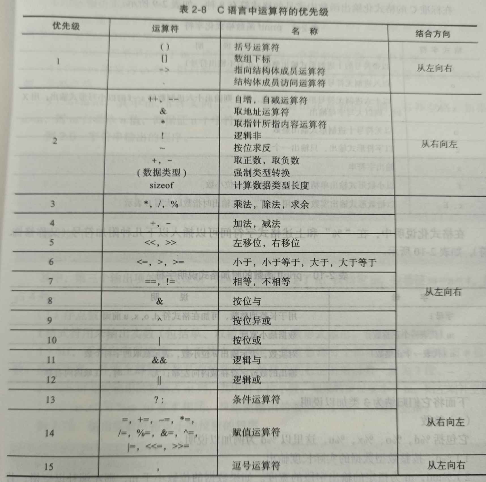
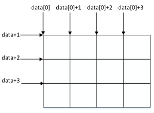
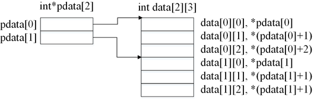
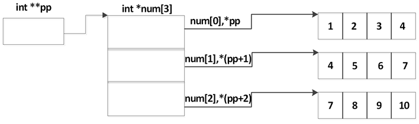
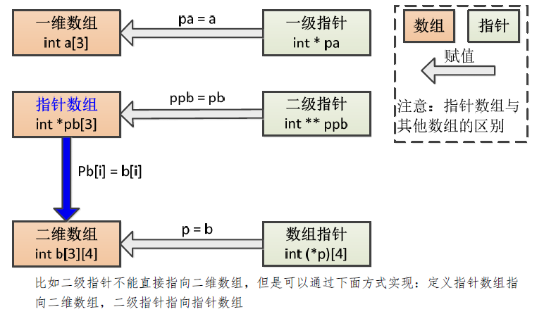
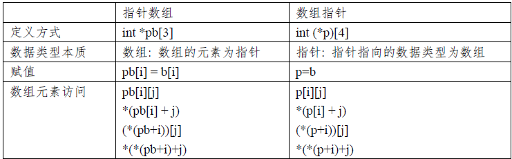
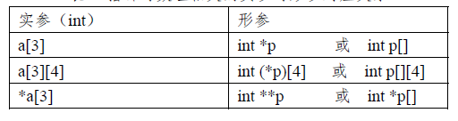
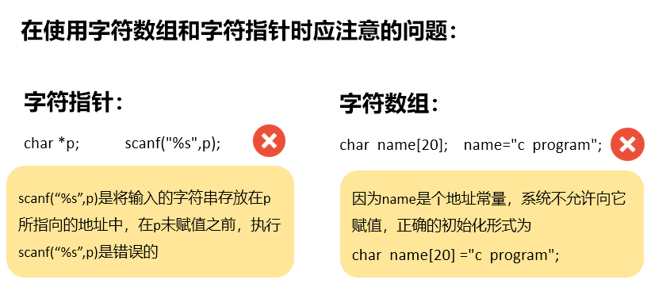
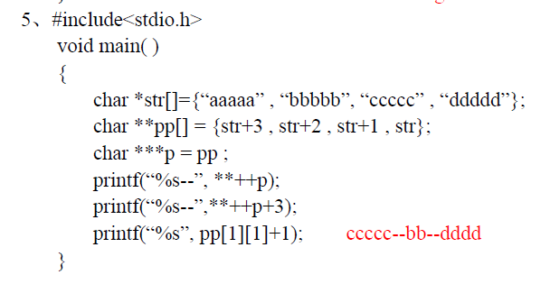

[TOC]


# C语言笔记

## 1. 基础

+ 原码：最高字节的最高位为符号位，1表示负号，0表示正号，其余是该数绝对值的二进制表示

  补码：其原码除符号位之外取反加1

+ 标识符的组成规则 :

    由字母(A\~Z，a\~z)、下划线\_和数字(0~9)组成，其==第一个字符为字母或下划线\_==

+ 格式化输出

  十进制整数:%d(带符号十进制)  %u(不带符号十进制)

  %x  十六进制整数

  %f    浮点小数(六位实数)

  %c   单一字符

  %s   字符串

+ scanf(%4d%2d%2d”,&a,&b,&c);

    假设输入序列为：20160125

    结果：a=2016,b=01,c=25

+ 在程序中必须用一个对应的变量接收读取的代码值，c = getchar( );

+ ==八进制以0开头，十六进制以0x开头==

+ 一个字符常量在内存中只占一个字节

  转义符’\\'的使用：==\\+三个数字--八进制的表示；\\+x+数字：16进制的表示==
  
+ 可以把一个字符常量赋予一个字符变量，但不能把一个字符串常量赋予一个字符变量

  ==字符串常量占的内存字节数等于字符串中字符数加1==

  增加的一个字节中存放字符’\0’ (ASCII码为0)

+ BC31中的字节数
| 类型名             | 说明           | 值域        | 字节数 |
| ------------------ | -------------- | ----------------- | ------ |
| **int**            | 整型           | -32768 ～  32767   | ==2==  |
| signed int        | 有符号整型     | ==-32768 ～  32767==  | 2      |
| unsigned int       | 无符号整型     | ==0 ～ 65535==       | 2      |
| **short int**      | 短整型         | -32768 ～  32767     | ==2==  |
| signed short int   | 有符号短整型   | -32768 ～  32767    | 2      |
| unsigned short int | 无符号短整型   | 0 ～  65535    | 2      |
| **long int** | 长整型     | -2147483648 ～  2147483647    | ==4==  |
| signed long int | 有符号长整型 | -2147483648 ～  2147483647 | 4     |
| unsigned long int  | 无符号长整型   | 0 ～  4294967295      | 4      |
| **float** | 单精度浮点型   | 约±\|3.4×10-38\|～±\|3.4×1038\|   有效数位7位  | ==4==  |
| **double** | 双精度浮点型   | 约±\|1.7×10-308\|～±\|1.7×10308\|  有效数位15位   | ==8==  |
| long double        | 长双精度浮点型 | 约±\|3.4×10-4932\|～±\|3.4×104932\|  有效数位18位 | 10     |
| **char**           | 字符型         | -128 ～  127             | ==1== |
| signed char        | 有符号字符型   | -128 ～  127          | 1      |
| unsigned char      | 无符号字符型   | 0 ～  255      | 1      |

## 2. 运算符

+ **当双目运算符的两个操作数的类型不同时，运算前遵循类型的一般转换规则将运算量自动转换成相同的类型，运算结果的类型与转换后的运算量的类型相同**

+ i = j = 10   赋值运算符按从右至左结合，即相当于i=(j=10),先将10赋给j,而括号中的赋值表达式（j=10）的**值就是赋值后的y的值**,再将其赋给i

+ 逗号运算符:(表达式1 ,表达式2 , 表达式3, …… ,表达式n)

  运算过程：先求表达式1的值，然后再求表达式2的值，依次计算下去，最后**表达式n的值也就是该逗号表达式的值。**

+ 位运算

  |              | a            | b         | 结果      |
  | ------------ | ------------ | --------- | --------- |
  | 按位与&      | 1001    0110 | 1000 0000 | 1000 0000 |
  | 按位取反~    | 0110 1010    |           | 1001 0101 |
  | 按位或\|     | 0011 0110    | 0101 0101 | 0111 0111 |
  | 按位异或^    | 0011 0110    | 0000 1111 | 1111 1001 |
  | 二进制左移<< | 0000 0100    | <<2       | 0001 0000 |
  | 二进制右移>> | 0000 0100    | >>2       | 0000 0001 |

  有符号数,若符号位是0,则左侧新位一律补0；若符号位是1,则左侧新位一律补1,称为“算术右移”

+ 算术运算自动类型转换:==值域较窄的类型向值域较宽的类型转换==

  赋值的自动类型转换：==类型完全由左值表达式的类型决定==

  强制类型转换：

+ 优先级：
  

+ 只有分号而没有表达式的语句就叫**空语句**；空语句格式为：

```C
；     //空语句$  
```

## 3. 控制语句

+ switch各个==case的判断值要求是整型常量==；若无break，程序将顺序执行下一个case语句组。

+ continue结束**本次循环**，即跳过循环体尚未执行的语句，接着进行下一次是否执行循环的判定。

  break则是结束整个循环过程，不再判断执行循环的条件是否成立。

  程序中使用goto语句时要求和标号配合，一般形式：

  ​        goto  标号;

  ​          …………

  ​         标号:  语句;

  功能：把程序控制转移到标号指定的语句处。既执行goto语句之后，程序从指定标号处的语句继续执行。

  注意: goto语句常用的用法是用它退出多重循环。

  goto语句为非结构化语句，**我们一般不提倡使用！**

## 4. 函数

+ ==当函数的数据类型为int时，可省略。==当函数不需要返回值时 ,将函数的数据类型指定为void 

+ **动态存储变量和静态存储变量**

  + 在程序运行期间，所有的变量均需占有内存，有的是临时占用内存，有的是整个程序运行过程中从头到尾占用内存。
  + 对于在程序运行期间根据需要进行临时动态分配存储空间的变量称为“动态存储变量”，对于在程序运行期间永久性占用内存的变量称为“静态存储变量"。

+ 变量定义的储存类型：

  + auto      自动型  ——————一般缺省时默认auto，自动型变量只能作内部变量

  + register    寄存器型————-存储在CPU的通用寄存器中，因为数据在寄存器中操作比在内存中快得多，在定义它的函数或复合语句内有效，即"局部可见"。 

  + extern     外部参照型—————X是外部参照变量，应在本文件之外去寻找它的定义

  + static      静态型 ——————在函数或复合语句内部定义的静态变量称为局部静态变量，在函数外定义的静态变量称为全局静态变量；

+ **函数间数据传递实现的方法：**

  + 使用函数参数在函数间传递数据
    + 值传递： 数据在传递方和被传递方占用不同的内存空间，被传递数据在被调用的函数中无论如何变化，都不会影响该数据在调用函数中的值
    + 地址传送方式传递：参数传递的不是数据本身，而是数据的存储地址；

  + 使用返回值传递数据：return语句只能把一个返回值传递给调用函数，当要求返回的值多于一个时不能使用返回值传递

  + 使用全局变量传递数据

## 5. 数组

+ 数组名表示数据存储区域的首地址。

  数组的首地址也是第一个元素变量的地址；data或者data[0]

  ==数组名是一个地址常量，不能向它赋值，也不能对它自加自减等对变量进行操作的运算==

+ 数组长度与提供初值的个数不相等;int b[20]={1,2,3,4,5};数组长度不能省掉,多余的元素都是0;

+ 

+ 矩阵相乘\[3][4]*\[4][5]

```c
  for(i=0;i<3;i++)
      for(j=0;j<5;j++)
          for(k=0;k<4;k++)
              valueC[i][j]+=valueA[i][k]*valueB[k][j];
```

## 6. 指针

### 6.1定义与赋值

==&符号的操作必须是左值表达式==

+ 不可以将一个整型常量直接赋值给指针

```C
int *pa = 1000;//错误
char *str = "abc";  //正确
printf("%s",str);//abc
printf("%s",*str);//正确
printf("%s",&str);//错误
int a[10];
&a[2]  :int *
&a //错误
register int k;
&k;//错误

```

### 6.2 指针的运算

#### 6.2.1 算术运算

+ p1+n;p1-n;当前指向位置的前方或后方第n个数据的位置

+ p1++;p1--;++p1;--p1;指向下一个/上一个数据的位置

  根据优先级：$y = *(p++)与y = *p++$均是当前指向目标的值赋给y后p指向下一目标；而$y = ++ (*p);$则是p的目标变量的**值**+1后赋给p；

  ```C
  int a = 10,*p = &a;
  y =*(p++); 或 y = *p++; //y = 10;*p = 0;指向空地址
  y = ++*p;//y = 11;*p =11;
  
  int*p,I,a[5];
       p=a;
       for (i=0;i<5;i++)
              scanf(“%d”,p++);
       for(p=a,i=0;i<5;i++)
             printf(“%d”,*p++);
  ```

+  p1-p2;

#### 6.2.2 关系运算

表示它们指向的地址位置之间的关系;指向后方的指针大于指向前方的指针[存储器的编号从小到大]

#### 6.2.3 赋值运算：**赋的值必须是地址常量或变量，不能是普通整数**

| 变量的地址赋予一个指向相同数据类型的指针 | char c, \*pc;  pc=&c; |
| -------------------------- | ------------------------ |
| 一个指针的值赋予指向相同数据类型的另一个指针 | int *p,   *q;  p=q;|
| **数组的地址赋予指向相同数据类型的指针**     | char  name[20], *pname;  pname=name; |
| 动态内存分配  | int  *p, n=20;  p=(int  \*)malloc(n\*sizeof(int));  if(p!=NULL)  { …  } |

### 6.3 ==指针与数组==

#### 6.3.1 ==一维数组==

```C
int a[10],*pa;
//赋值时：
pa = a;  pa = &a[0];
//等价关系***********************************************************
*pa == a[0]; 
*(pa+i) ==pa[i]== a[i]==*(a+i);  
scanf("%d",pa+i);

//注意  a++;错误
//函数形参
int *p == int p[]
```

#### 6.3.2 多维数组与指针

##### 1. 多维数组的地址

+ n维数组的**数组名是指向n-1维数组的指针**，其值为n维数组的首地址，类型为n-1维数组类型的指针
+ n维数组的**元素是指向n-1维数组的元素的指针**，其值为n-1维数组的首地址，类型为n-1维数组的元素类型的指针
+ 

##### 2. ==数组指针==

以==N-1维数组==为==数据类型==定义指针变量，则可处理以N-1维数组为元素的一维数组

```C
int a[10],(*ap)[10];
ap = a;//错误，a的类型int *;ap的类型int (*)[10];
ap = (int (*)[10])a;//正确
(*ap) == a;
(*ap)+i == a+i;
(*ap)[i] == *((*ap)+i) == a[i] == *(a+i)//ap[i]与*ap[i]与*(ap+i)错误


int b[3][4];
int (*pb)[4] = b;
b[i][j] == (*(pb+i)+j)
    
//函数处理多维数组:
int max(int a[][4],int n);
void search(int (*p)[4],int n);
在函数中的操作：
    a[i][j]或者*(*(a+i)+j)
```

### 6.4 指针数组与多级指针

####  6.4.1  ==指针数组==

:指针的集合，它的每一个元素都是一个指针变量，并且它们具有相同的存储类型和指向相同的数据类型



```C
int data[2][3];
int *pdata[2];
pdata[0] = data[0] 或者 = &data[0][0]; 
data[i][j] == *(data[i] + j) == pdata[i]+j == pdata[i][j];
data[i]++ 或者 pdata[i]++ 得到的是pdata[i][1];
```

#### 6.4.2 指针数组与数组指针分别处理多维数组

```C  
void output1(int **app,int n);
void output2(int (*bpp)[3],int n);
void main( )
{   
    int *ap[5];//指针数组
    int (*bp)[3];//数组指针
    int i,j;
    int arr[5][3]={{1,2,3},{4,5,6},{7,8,9},{10,11,12},{13,14,15}};
    for(i=0;i<5;i++)    
        ap[i]=arr[i];//指针数组的赋值 
    bp=arr; //数组指针的赋值
    output1(ap, 5);        //以指针数组名作为实参
    output2(bp, 5);        //以数组指针名作为实参
}
void output1(int *app[], int n)
{
    int i,j;
    printf("the array is:\n");
    for(i=0;i<n;i++)
    {   for(j=0;j<3;j++)
        printf("%-5d", *(*(app+i)+j));
        printf("\n");
     }
}
void output2(int (*bpp)[3], int n)
{
    int i,j;
    printf("the array is:\n");
    for(i=0;i<n;i++)
    {
        for(j=0;j<3;j++)
        printf("%-5d", *(*(bpp+i)+j));
        printf("\n");
    }
}
```

#### 6.4.3 多级指针

如二级指针：指向指针的指针：int *pp


```C
int **ap,*p,num;
p = &num; ap = &num;num=100;
**ap == *p == num  ==100;
//二级指针处理指针数组

int arr[3][4]= {{1,2,3,4},{4,5,6,7},{7,8,9,10}};
int *p[3],**pp;
for(i=0；i<3;i++) 
	p[i]=arr[i];
pp = p;//使二级指针p指向指针数组p的首地址
out(pp);
arr[i][j] == *(arr[i]+j) == *(*(num+i)+j) == p[i][j] == *(p[i]+j) == *(*(pp+i)+j)
void output(int **p, int n1, int n2);  //n1,n2为二级指针指向的数组行列数
```

### 6.5 指针与函数

#### 6.5.1 返回函数的指针

函数中必须有$return$语句，其后跟随的表达式结果值可以是**变量的地址、数组首地址、已经定向的指针变量、结构变量地址、结构数组的首地址**等。

注意，不能把**被调用函数内的自动变量的地址和自动型数组的首地址**作为指针函数的返回值

```C
double *square(double data)
{
     double result = 0.0;
     result = data*data;
     return &amp;result;
}//错误例子
```

#### 6.5.2 指向函数的指针

+ 注意事项

  + 
  + 

  + 

## 7. 字符串

### 7.1 基本概念

+ 字符数组：char color[20] = "blue"；

  + 一维数组初始化方法：

    + char string[20]={ 's' , 't' , 'r' , 'o' , 'n' , 'g' , '\0' };//在指定初值时，必须在最后一个值之后必须明确地写上‘\0’

    + char string[20]="hello";//自动在末尾加有 '\0 '字符，作为一个结束标志

  + 二维数组初始化

  ```c
  char string[3][10]={   "pascal","cobol" ,"fortran" };
  //或者
  for(i=0;i<3;i++)
  	scanf("%s", string[i]);
  ```

+ 字符指针：char  * colorPtr = "blue"；

  + 初始化：

    + 直接使用字符串常量作为初始值 **char *string = "we are family!";**

    + 将一个字符串常量赋予一个指针 **char *p;          p= "c program";**

    + 注意：①系统开辟一块区域存储这个字符串

      ​			②将首地址赋予指针

      由于这块区域已经固定，因此如果要处理该常量字符串时，要**保证处理后的字符串长度不能超过初始的字符串长度，否则会修改初始字符串所在区域后面的数据**，有可能会影响系统的运行

+ ==注意事项：==

  

### 7.2 字符串函数

+ 转换函数：
```C 
double atof (const char *nPtr);//将字符串转换为浮点数的函数
int atoi (const char *nPtr); //将字符串转换为整数的函数
long atol (const char *nPtr);//将字符串转换为长整形的函数
void itoa(int n,char s[],int radix);//将整数n转换为字符串的函数

char *strcat(char *dest,char *src);//字符串连接函数
//字符数组1必须足够大，以便容纳连接后的新字符串
//连接前两个字符串的后面都有一个'\0',连接时将字符串1后面的'\0'取消，只在新串最后保留一个'\0'
int strcmp(char *s1,char *s2);
//从第一个字符开始逐个字符相比（按照ASCII码大小比较），直到出现第一个不同的字符或遇到’\0’为止。
//字符串1大于字符串2，函数返回值为一正整数。
int strlen(char *s);//求字符串的长度函数
char *strupr(char *str);
char *strlwr(char *str);//字符串大小写转换函数

char *strstr(char *s1,char *s2);//查找指定字符串在给定字符串中第一次出现的函数
//这个函数在s1中查找整个s2第一次出现的起始位置，并返回一个指向该位置的指针。如果s2并没有完整地出现在s1的任何地方，函数将返回一个NULL指针。如果第二个参数是一个空字符串，函数就返回s1。
```

### 7.3 利用动态内存分配处理单个字符串

### 7.4 多个字符串的处理

+ 字符指针数组

```c
char *proname[ ]={"pascal","basic","cobol","prolog","lisp"};
sortstr(proname,5);    
void sortstr(char **v, int n)
{
        int i,j;
        char * temp;
        for(i=0;i<n-1;i++)       
             for(j=i+1;j<n;j++)
      	        if(strcmp(v[i],v[j])>=0)
                    temp=v[i];v[i]=v[j];v[j]=temp;
}
```

+ 多维字符数组

```c
char str[10][80]; 
void sortstr(char (*p)[80],int n)
{
    int i,j;
    char temp[80];
    for(i=0;i<n-1;i++)
        for(j=i+1;j<n;j++)
            if(strcmp(p[i],p[j])>0)
                strcpy(temp,p[i]);
                strcpy(p[i],p[j]);
	            strcpy(p[j],temp);
}
```

+ 动态内存分配

### 7.5 带参数的main函数

## 8. 结构与联合

#### 8.1 结构的定义与使用

+ 结构的初始化：

  struct 结构名  结构变量={初始数据}；

  初始数据之间用逗号分隔，**初始数据的个数与结构成员项的个数应该相同**。每个初始数据必须符合与其对应的成员项的数据类型。

#### 8.2 结构数组与结构指针

+ 结构数组：

  在对结构数组进行初始化时，**方括号[ ]中的元素个数可以缺省**

  结构数组也具有数组的属性，结构数组名是结构数组存储首地址

+ 结构指针：

  + <存储类型> struct 结构名 * 结构指针名 [ = 初始地址值 ]; 

  + 结构指针的增（减）量运算，将**跳过一个结构变量的整体，指向内存中下一个结构变量或结构数组中下一个元素**，结构指针本身的（物理）地址增量值取决于它所指的结构变量的数据长度

  + 在结构嵌套中，当结构体的成员项具有由该结构类型定义的**结构指针**时，这种结构体称为递归结构体

  + (*student).name;    student->name;


#### 8.3 结构在函数间的传递

+ 用结构体变量的成员作参数：“值传递”
+ 用结构体变量作实参：“值传递”  
+ 用结构变量的地址或结构数组的首地址作为实参：”地址值“
+  
+ 返回结构变量的函数：
```C
struct Record str_add_int(struct Record x);

```

+ 结构指针型函数：

  结构指针型函数是**以地址传递方式**向调用它的函数返回结构的数据。不仅可以返回某个结构的地址，也可以返回结构数组的地址，从而把函数中处理的若干结构的数据返回给调用它的函数中
  ```C
  struct Sample *find(struct Sample *pd,int n);    
  ```

#### 8.4 位字段结构

#### 8.5 联合

联合体在存储时总是按照其成员中数据长度最大的成员项占用内存空间

联合体的内存空间中在某个时刻只能保持某个成员项的数据

# 题目：

#### ==排序的方法：==

```c
//冒泡排序法
for ( i=0 ;i<N-1; i++) 
{
    for (j=0;j<N-1-i;j++)
    {
        if(a[j]>a[j+1])
        {
            t = a[j]; 
            a[j] = a[j+1];
            a[j+1] = t;
        }
    }
}
//选择排序法
        
//边比边交换
for ( i=0 ;i<N-1;i++)                
	for (j=i+1;j<N;j++) 
		if(a[i]>a[j])
        {
            t  = a[i];
            a[i] = a[j];
            a[j] = t; 
        }

//边找边，边设立标记
for ( i=0 ;i<N-1; i++) 
	j=i;         //记录最小值下标
	for ( k = i+1;k<N;k++)   
		if(a[k] < a[j])  
            j=k;     
    if(j!=i)             
		t = a[i];a[i] = a[j];a[j] = t;
```

#### 判断题：

+ 指针数组、数组指针、多级指针
```C
int p[3][4];
int *pa[3];//指针数组:一个指针，其指向的地址时数组
int (*pb)[4];//数组指针：一个数组，其中每个元素是指针
int **pc;//二级指针
//二维数组赋给指针数组
for(i=0;i<3;i++)
    pa[i] = p[i];
//二维数组赋给二级指针：先建立一个指针数组如上
pc = pa;
//二维数组赋给数组指针
pb = p;

//题目：
int (*pa)[8],a[6][8];
pa =  *a++;//错误，数组指针可以直接复制数组，但数组不能自加；
pa = a+1;//？？？？？？？？？？？？？？？？？？？？

int **pp,a[6][8];
pp = a;//二级指针必须通过指针数组循环赋值后再赋值
```
+ 初始化定义

```C
# define N =50;
int a[N];//错误

int x = '\a7';//正确
//'\a' 转义后的值是 0x7, 后边'7'的ASCII值是0x37, 把 0x7, 0x37 顺序给x的最低两个字节

int x = (018 == 'A');//错误，八进制无8
int x = （013 = =‘A’）;  //正确，八进制与字符的匹配

char c = '55';//正确
char a = 'a',c;
c = ++a;//正确 输出b

int a,b;											
scanf(”%d,%f”,a,b);//错误，scanf函数不可以强制转换
printf(“%f\n”,(40,50,60));//错误,printf函数不可以强制转换

int n;
scanf("%d",&n);
int a[n];//错误：BC31要求定义在所有之前

int   *p,a[10];
*p=a[0]; //错误：？？？？？？？？？？？？？？？？？？？？？？？？？？？？？？？？？


char *pstr, str[20];
pstr=str=”HUST”; //错误，字符数组的赋值，这种形式只能在定义时  char str[20] = "HUST";

while(3) 
    if(getchar()==‘0’)
        break;//正确的 

char * p="hust";// (  X  )
gets (p);//指向常量之后就不能会更改
```

#### 运算结果题

```c
//无符号整数的运算
unsigned int a=7, b=17, c=5, d=3;
float f;

f =c/d;		//1.000000										
(!(a+b)+c-1)||(b+c/ 3)   //1									
(a&b)^( ~c | ~d)		//-1 ????????						
f= (a-b>0 ? c/d : c%d ); 	//1.000000					
b=a++ , a%3	//2

//多维字符数组的排序：
strcmp(str_1,str_2)//纯粹按照ASCII码排序
strcmp(strlwr(str_1),strlwr(str_2))//按照字典排序

int x=3,y=-4,z=4; 
unsigned int a=7, b=17, c=4, d=2 ;
float k=3.5,f; 
y>z||z>2 && x++  //&&的优先级大于||,先算右边:1
×|z & x^z  //优先级：&  >  ^  >  |,算出结果7
x-y+!z-1&&x+y/2 //1
y+ (x/3*(int)(x+k)/2) %4  // -1
f=(d-c)/2  //32767.0 
```



#### 改错题

```c
//不要改的部分

//容易忘记改的部分
scanf("%",&str);--> scanf("%s",str);

char str[80];
gets(str);
for(i=0;i<80;i++) --->  for(i=0;str[i]!='\0';i++)
    
int a[N];
for(i=0;i<=N;i++)--->for(i=0;i<N;i++)
    
//注意+=时有没有提前赋值0
    
float v = 4/3 *pi *r*r*r;-->flaot v = 4.0/3 *pi*r*r*r;

#define pi=3.14415926;-->#define pi 3.1415926
```

#### 程序填空

#### 编程题
(1)已知五位数a2b3c能被23整除，编程求此五位数。 
(2)输入一行包含若干单词的字符串，单词之间用空格分开，要求按单词长短从小到大的次序排序后形成新的字符串输出。(假定字符串中单词个数不超过20个，字符中输入并形成单词序列、单词排序、排序后的单词形成新串并输出，要求用不同的函数实现，编写主函数完成上述函数的调用) (3)请编写程序，主函数中输入一行字符串，内有数字字符和非数字字符，调用函数(自己定义及实现的函数)求该字符串中数字子串中最小的数字，并在主函数中显示最小的数字。限定该字符串中数字子串最多不超过20个。如字符串“a1236345.6×876.176t”，该字符串中含有数字子串最小的数字是876.176。
(4) 一个公司，有若干名员工，每名员工有姓名，性别，工龄，工资等信息，
编程输入并建立员工档案信息和便于发放的各种钞票数（工资为整数，发放的工资各种钞票限定为100元，50元，20元，10元，5元，1元，发放的钞票数张数要求最少）,要求输出工龄大于20年，工资高于5000元的所有男员工信息和工资发放的各种钞票数。(要求输入和输出功能用不同的函数实现，编写主函数完成上述函数的调用
