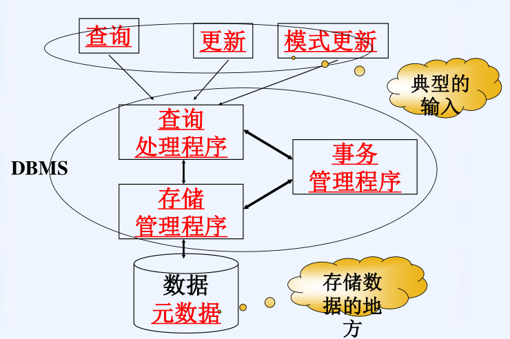
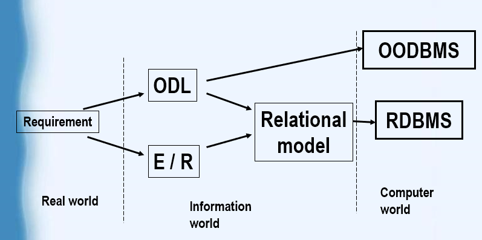

# DB

## 数据库概论

+ 产生与发展：人工管理-->文件系统-->数据库系统

* 数据库系统的组成：数据（库）、用户、软件和硬件
  
    * 数据（库）
    * 软件：DBMS是数据库系统的核心软件
    * 硬件：储存和运行数据库系统的硬件设备（CPU、内存等）
    * 用户：使用数据库的人
        * 终端用户
        * 应用程序员
        * 数据库管理员
          * 数据库管理员的职责

    

* 元数据：有关数据结构的信息

* 查询
  
    * 通过通用的查询接口。
      
    * 通过应用程序接口。
  
* 更新：更新数据的操作，也有上面两种方法

* 模式更新
  
    * 由被授予了一定权限的人使用，更改数据库模式或者建立新的数据库。
    * 会导致应用程序的更新
    
* 存储管理程序
  
    * 任务是从数据存储器获得想要查询的信息，并在接到上层的更新请求时更新相应的信息
      
    * 文件管理程序
      
    * 缓冲区管理程序
  
* 查询处理程序
  
    * 任务是，把高级语言表示的查询或数据库操作(如SQL查询语句)转换成对存储器数据（如某个关系的特定元组或部分索引）的请求序列
    * 最困难的部分是查询优化，查询优化往往要利用现有的索引
    
* 事务（一组按顺序执行的操作单位）管理程序
  
    * 负责系统的完整性
      
    * 事务管理程序的ACID特性
      
        * 原子性(Atomicity)：要求整个事务都执行或者都不执行
        
        * 一致性(Consistency)：要求数据符合客观世界的要求或限定条件。
          
        * 隔离性(Isolation)：当两个或更多的事务并发运行时，它们的作用效果必须互相分开。
          
            * 隔离性可利用**加锁**来实现。
              
                * 加锁：事物管理程序对事务要访问的数据项加锁，其他事务就不能访问他
          
        * 持久性(Durability)：如果事务已经完成，即便系统出现故障，事务的结果也不能丢失。
          
            * 持久性可利用日志和事务提交来实现
              
                * 日志：包括每个事务的 开始，引起的数据库的更新，结束的所有信息
                
                  记在非易失性储存器上
                
              * 事务提交

数据库建模步骤：

1. 需求分析
   需要哪些数据、应用程序和操作
2. 概念数据库设计:star2:
   使用 E-R 模型或类似的高级数据模型的数据、约束的高级描述
3. 逻辑数据库设计
   将概念设计转换为数据库模式
4. 架构细化
   关系规范化：检查关系模式是否存在冗余和相关异常。
5. 物理数据库设计
   索引、集群和数据库调优
6. 安全设计
   识别不同的用户组及其角色
   

# 数据模型的组成和抽象过程

## 数据模型的组成要素

* 数据结构：描述系统的静态特性，所研究对象特性的集合
  * 层次结构、网状结构、关系结构和面向对象的数据结构四种类型
* 数据操作：描述系统的动态特性。数据操作是对数据库中各种数据操作的集合，包括操作及相应的操作规则。
  * 定义操作的确切含义、操作规则以及实现操作的语言。
* 数据的约束条件：一组完整性规则的集合。

## 数据的抽象

# 对象
