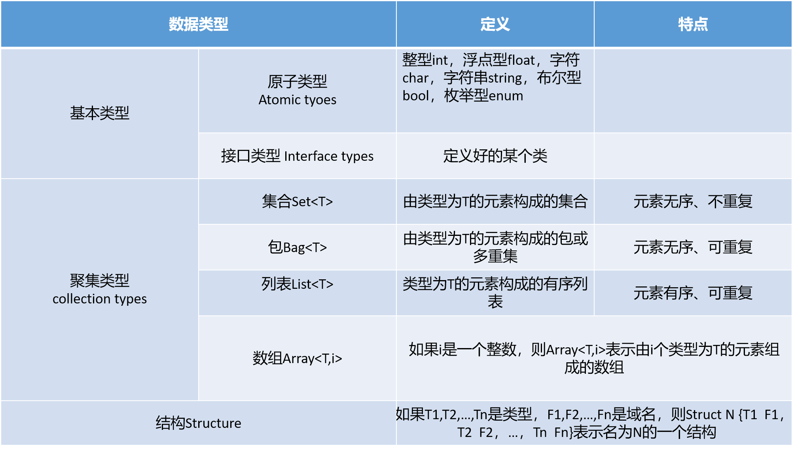
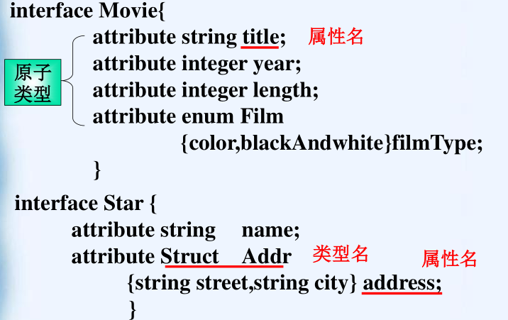
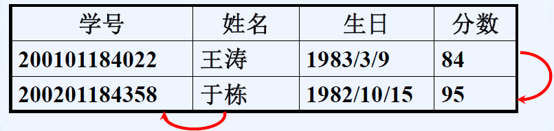
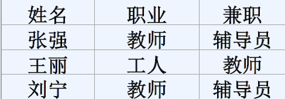
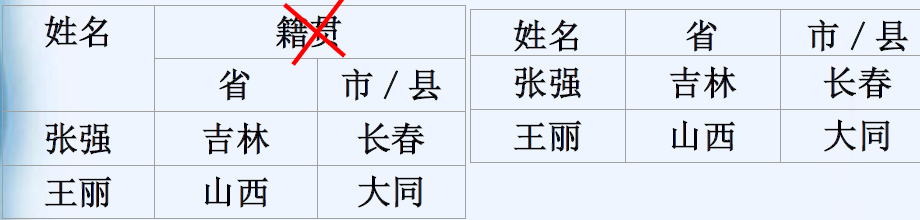

[TOC]
# 对象定义语言（ODL）

ODL(Object Definition Language)：用面向对象的术语说明数据库中数据的结构的一种标准语言，主要用途是书写面向对象数据库的设计，进而将其直接转换成面向对象数据库管理系统(OODBMS)中的数据结构。

## 基本ODL

### ODL的类

关键字interface：表示类说明的开始
类的名字：表示某种具有共同特性的对象的集合的变量
用花括号括起来的类的特性表（包括属性和联系）
interface 类名{
			<特性表>;
}

### ODL中的数据类型



类型构造符：四种聚集性符号和结构符号

==ODL中的数据类型规则==

+ ==属性==的数据类型:
  原子类型；
  类型构造符**单次**应用于**原子类型或结构**构成的**聚集类型或结构**；
  不能是接口类型

+ ==联系==的数据类型
  接口类型；
  类型构造符**单次**应用于**接口类型**构成的**聚集类型**；  
  不能是原子类型、结构

实例判断：
1.判断下面数据类型应用于属性是否合法:
integer                                                                              （<font color='red'>T</font>）
Struct N{string field1,integer field2}                            （<font color='red'>T</font>）
List<real>                                                         
Array<Struct N {string field1,integer field2}>                   （<font color='red'>F</font>）
List<Movie>（假设Movie是已经定义好的类）                   （<font color='red'>F</font>）
2.判断下面数据类型应用于联系是否合法：
Struct N{Movie field1,Star field2}               （<font color='red'>T</font>）
Set<integer>                       （<font color='red'>F</font>）
Set<Array<Star>>（假设Star是已经定义好的类）             （<font color='red'>F</font>）

### ODL的属性：

利用数据类型的值描述对象的某个方面的特征：
**关键字attribute+属性的数据类型+属性的名字+分号；**


### 联系与反向联系

类的一个对象与同一或不同类的的其他对象的关系特性
+ ==基本要素==：关键字(relationship)+**联系的数据类型**+联系的名字 \\\\+关键字(inverse)+类名::反向联系的名字+分号
  

书写时：
==A:
relationship A对B的联系的数据类型 联系名（A的B）
inverse B的类名::反向联系名（B的A）；
B:
relationship B对A的联系的类型 反向联系名
inverse A的类名 ：：联系名==

+ 联系的规则：类C的联系R把C的对象X和类D的每一个对象或多个对象$y_1,..y_n$的集合相连，R的反向联系：把类D的每个对象$y_i$和C的对象x相连（C和D可以同类）

* 自身的联系：
  例题：
  设计一个家谱数据库的类Person:要求记录每个人的姓名；记录学院关系的联系：母亲、父亲和孩子
  
* 联系的多重性：联系及其反向联系的唯一性要求
  | 类型                   | 联系                                 | 反向联系                             |
  | ---------------------- | ------------------------------------ | ------------------------------------ |
  | 从类C到类D的多对多联系 | 至少C中有一个对象和D中对象的集合有关 | 至少D中有一个对象和C中对象的集合有关 |
  | 从类C到类D的多对一联系 | 每个C中的对象和唯一的D中对象有关     | 至少D中有一个对象和C中对象的集合有关 |
  | 从类C到类D的一对一联系 | 每个C中的对象和唯一的D中对象有关     | 每个D中的对象和唯一的C中对象有关     |
```sql
例题：为某公司设计数据库，要求保存以下信息：
雇员：雇员号、姓名、年龄、地址、所在部门。  
部门：名称、雇员、经理、所销售的商品。     
商品：名称、制造商、价格、型号、编号。  
制造商：名称、地址、商品名           
interface GuYuan{      
attribute intguyuanID;attribute string name;
attribute intage;attribute string address;
relationship dep workIn  inverse dep::myworker;
relationship dep headOf inverse dep::header;}
interface dep{      
attribute string name;
relationship Set<GuYuan> myworker inverse GuYuan::workIn; 
relationship GuYuan header inverse GuYuan::headOf;
relationship Set<shangP> forsale inverse shangP::toDep;}
interface shangP{      
attribute string name;
attribute float price;
attribute string modelID;
attribute string shangpID;
relationship dep toDep inverse dep::forsale;
relationship Set<maker> madeby inverse maker::producer;}
interface maker{      
attribute string name;
attribute string address;
relationship Set<shangP> producer inverse shangP::madeby;}
```
## 高级ODL

### ODL的子类

子类和超类：ODL中，如果一个类对象具有另外一类对象所有的特性，同时又具有其他特性，此时该类为另外一类的子类，另外一类称为该类的超类。
子类的说明方法：假设C是D的子类，在类C的说明中，在类C后面加上冒号和类D的名字

```c
interface 子类名：超类名{
    <特性表>；
}
```
子类定义中的特性表中不包括超类中已含有的特性，子类继承其超类的所有特性。
假设要记录卡通片的配音演员
Cartoon为Movie的子类，用以下的ODL说明:
interface Cartoon:Movie{
relationship Set<Star> voice inverse Star::voiceof;
}
在Star中增加
relationship Set<Cartoon> voiceof inverse Cartoon::voice;

**子类的多重继承**

1. 一个类可以有多个子类
2. 子类可以有子类，可以形成类的层次，每个类都继承祖先的特性。
3. 一个子类可以有多个超类（超类用逗号放在冒号后）
   将这多个超类用逗号隔开放在冒号后。
   
   ```C 
   interface 子类名：超类名1,超类名2,……{
   <特性表>;
   }
   例如：Movie的一个子类Cartoon，
   interface Cartoon:Movie{relationship Set<Star> voices…;}
   再假设保存谋杀片信息，
   interface Murder:Movie{attribute string Weapon;}
   有的电影既是卡通片，又是谋杀片，则可以说明另一个子类
   Cartoon-Murder来描述这种情况，说明如下：
   interface Cartoon-Murder:Cartoon,Murder {}
   类Cartoon-Murder的特性包括Movie的所有特性，Cartoon中新增的一个联系，Murder
   中新增的一个属性。
   ```
### ODL中键码的说明
要素：圆括号，关键字Key或Keys，构成键码的属性或**属性集列表**（用括号括起来）
                 （keys  (键码1之属性1,键码1之属性2,…),键码2之属性）
键码说明必须紧跟在接口名之后，在左花括号之前说明。
如果有多个键码，则各个键码之间用逗号隔开

```sql
1)interface Movie (key (title,year)){
//接着为属性和联系表
2)(key empID,ssNo)
与(key (empID,ssNo))的含义是不同的。
3)记录学生信息，并为其选择合适的键码。
interface Student(key studentID){
attribute string name;
attribute string studentID;
attribute integer age;
……
}
```

## 设计原则

真实性
避免冗余
对简单型的考虑
选择合适的元素属性

# 关系模型
## 基本概念

 **关系模型的术语**
| 术语       | 意义                                                         |
| ---------- | ------------------------------------------------------------ |
| 关系模型   | 以二维表的形式来表示数据的相关特性以及数据之间的联系的一种数据结构 |
| 关系（表） | 关系模型中的每个二维表称为关系。关系是现实世界中的信息在数据库中的数据表示。<br />表是含有数据库中所有数据的数据库对象。 |
| 元组       | 表格中的一行，如学生表中的一个学生记录即一个元组。           |
| 属性       | 表格中的一列，相当于记录中的一个字段<br />如学生表中有五个属性(学号，姓名，性别，年龄，系别)。 |
| 键码       | **可唯一标识元组的属性或属性集**，<br />如学生表中学号可以唯一确定一个学生，为学生关系的键码 |
| 域         | 属性的取值范围，通常通过属性的数据类型以及各种约束来实现。<br />如学生表中年龄的域是(14~40),性别的域是(男、女)。 |
| 分量       | 每一行对应的列的属性值，即元组中的一个属性值<br />如学号、姓名、年龄等均是一个分量。 |
| 关系模式   | 对关系的描述，一般表示为：<br/>关系名(<u>属性1</u>，<u>属性2</u>，……，属性n)<br/>其中加下划线表示这两个属性的集合构成键码。 |
| 实例       | 将给定关系中元组的集合称为该关系的实例。实例会随时间发生变化 |
| 当前实例   | 目前该关系中元组的集合                                       |

关系的特性
1.关系中不允许出现相同的元组；
2.元组的顺序（行序）无关紧要，可 以任意交换；
3.关系中的属性的顺序（列）无关紧要，可以连同属性名一起交换；
4.同一属性名下的个属性值必须是同一类型的数据；
5.关系中各属性必须有不同的名字，不同的属性可以来自同一域；

6.属性可以为空；
7.关系中的每一分量必须是不可分的数据项，或者说所有属性值都是原子的，即是一个确定的值，而不是值的集合 


**关系模型的优缺点**

关系模型的优点
    它有较强的数学理论根据(关系代数)。
    数据结构简单、清晰，用户易懂易用。
    关系模型的存取路径对用户透明，从而具有更高的数据独立性、更好的安全保密性，也简化了程序员的工作和数据库建立和开发的工作。
关系模型的缺点
     由于存取路径对用户透明，查询效率往往不太好，因此，为了提高性能，必须对用户的查询表示进行优化，增加了开发数据库管理系统的负担

## 从ODL到关系模型
首先用与类名相同的名字建立一个关系名

### 属性的转换

根据数据类型确定**属性**的转换方式
原子类型：**每个属性对应于关系的一个属性**，关系的属性名和相应类的属性名相同。 
                 枚举类型实际上是前几个整数的别名列表。因此，枚举类型可以用整型的属性来表示。 
非原子类型

+ 结构：**结构的每个域都转化成关系的一个属性；**如果两个结构有相同的域名，则必须在关系中使用新的属性名，以示区别
  interface Star{ 
  ​	attribute string name; 
  ​	attribute Struct Addr{string street,string city} address;};
  转换成关系模式为Star(name,street,city)  

+ 集合：模型中的属性名称与ODL中一致，属性的数据类型也与ODL中一致，只是**ODL中的每个对象都会对应关系模型中的多个元组**，元组的数量就是对应集合属性的取值数量。
  使用这种方法由ODL转换成关系，如果除了属性A和键码外还有其他属性，则会产生冗余信息。 
  例 假设有ODL如下:     
  interface Star{     
  attribute string name     
  attribute Set<Struct Addr{string street,string city}> address;     
  attribute date birthdate;}     
  转换成关系模式为：Star(name,street,city,birthdate)     

+ 包：在关系模式中**增加一个计数的属性count**，用以表明**每个元组中对应的属性是包的多少次成员** 
  例 Bag<int>，则转换到关系模式中变成两个属性，原属性和count(为int类型)。 

+ 列表：列表可以增加**一个新属性position(位置)来表示**，用来**表明在列表中的位置。**
  例: List<int>，则转换到关系模式中变成两个属性：原属性和position(为int类型)。  

+ 数组： 定长的数组可以**用带有数组位置标志的属性表示**
  例:Array<Struct Addr{ string street,string city } ,2>则转换到关系模式中变成street1,city1,street2,city2

### 联系与反向联系的转化
+ 单值联系，把该联系看成是一个属性，该属性**由与之联系的类的键码属性或属性集合构成**。
  转换成关系模型时，用**与之联系的类中构成键码的属性集**来代替这个单值联系作为关系的属性。  
+ 多值联系，即当联系是某个类的聚集类型时，同样需要首先找出相关类的键码，然后与数据类型为集合的属性的处理方法一样，需要为**每个值建立一个元组**。
  这种方法带来了冗余。因为对应于集合的每个成员，该关系的其他属性都将它们的值重复一次
#### 多值联系的转换
假设类C转换成关系模式，那么对应的关系中的属性构成
包括：

+ 类C的所有属性
+ 类C中所有单值联系对应的类的键码属性
+ 类C的多值联系对应的类的键码属性

有时，一个类可能有多个多值联系。在这种情况下，表示类中的一个对象所需的元组数会爆炸性增长。
假设类C有k个多值联系R1,R2,…,Rk，类C的某特定对象O通过联系R1与n1个对象相联，通过R2与n2个对象相联，……。
那么在类C对应的关系中，共有n1╳n2╳…╳nk个元组对应于ODL中设计的对象O
**实例：**
假设类C有一个单值属性X和两个多值联系R1和R2，这两个联系将类C分别与键码属性为Y和Z的两个类相联。
现在，考虑类C的一个对象c,假设对象c的属性集X的值为x，
并且c通过联系R1与键码值分别为y1，y2的两个对象相联，
通过R2与键码值分别为z1，z2，z3的三个对象相联。
于是，对象c在对应于类C的关系中需要用六个元组表示,也就是Y对应的键码与Z对应的键码的所有可能组合。
(x,y1,z1) (x,y1,z2) (x,y1,z3) (x,y2,z1) (x,y2,z2) (x,y2,z3)

#### 联系单向表示的选择原则
ODL中联系与反向联系转换到关系模式时，==二者只需选择一个进行转换，另一个则舍弃==。其原则是
1. 如果是多对多或一对一的联系，两个类中任选一个进行该联系的转换都可以。
2. 如果是多对一的联系，则==选择包括“多”的联系的类==，即该类中的多个对象对应于另一类的一个对象。这样做可以避免冗余
### 子类的转换
将ODL子类转换成关系模式原则：
1. 为每个子类建立自己的关系；2. 这个关系应该包括子类自己定义的特性以及它从超类继承的全部特性。

  假设除了类Movie外，还有以下三个类，
```sql
interface Cartoon:Movie{relationship Set<Star> voices…;}
interface Murder:Movie{attribute string Weapon;}
interface Cartoon-Murder:Cartoon,Murder {}
将这四个类转换成关系，这四个关系的模式如下：子类到关系的转换 例
Movie(title,year,length,filmType,studioName,starName)
Cartoon(title,year,length,filmType,studioName,starName, voice)
Murder(title,year,length,filmType,studioName,starName, weapon)
Cartoon-Murder(title,year,length,filmType,studioName, starName,voice,weapon)
```
另一种解决方法：使用NULL值
利用NULL来合并，则得到一个关系，
其模式为：
Movie(title,year,length, filmType, 
studioName,starName,voice,weapon) 

### 键码的处理

在ODL中没有定义键码并且无法断定哪些属性可以作为键码时，**必须在相应的关系中引入一个属性，代替该类对象中的对象标识**。如果在ODL中定义了键码，则直接继续下一步。

转换后关系的键码需要考虑该类的联系的情况。
+  假设类C指向某个类D的联系R是一对一或者多对一，C的键码依然是相应关系的键码。
+ 设类C指向类D的联系R是“多对多”的联系，则需要把D的键码加入到C的键码中，来组成关系的键码。
  如果类C有多个多对多联系，则所有这些多值联系所连接的类的键码都必须加入到转换后的关系C的键码中，得到的结果才是C对应的关系的键码。

关于自身到自身的联系的键码转换：
转换后的关系需要为每一次自身联系提供一次键码(此时需要经过改名)

```sql
interface Person (key name){
attribute string name;
relationship Person motherOf inverse Person::childrenOfFemale;
relationship Person fatherOf inverse Person::childrenOfMale; relationship Set<Person> childreninverse Person::parentsOf;
relationship Set<Person> childrenOfFemale inverse
Person::motherOf;
relationship Set<Person> childrenOfMaleinverse
Person::fatherOf;
relationship Set<Person> parentsOf inverse Person::children;}
Person(__name,nameofmother,nameoffather,nameofchildren__)
```

键码转换例子:

实例：

```sql
interface Customer (key ssNo) {attribute string name;    
	attribute string addr;
	attribute string phone;
	attribute integer ssNo;    
	relationship Set<Account> ownsAccts   
	inverse Account::ownedBy;}
interface Account (key number) {attribute integer number;    
	attribute string type;    
	attribute real balance;    
	relationship Customer ownedBy  
	inverse  Customer::ownsAccts;}
Customer(__ssNo__, name, address, phone) 
Account(__number__, type, balance, ssNo)
```

```sql
interface Ship (key name) {
    attribute string name;
	attribute integer displacement;
    attribute string type;} 
interface Gunship:Ship {
    attribute integer numberOfGuns;    
	attribute integer bore;}
interface Carrier:Ship {
    attribute integer deckLength;    
	attribute Set<string> airGroups;} 
interface Submarine:Ship {
        attribute integer maxSafeDepth;} 
interface BattleCarrier:Gunship,Carrier {}

Ship(__name__, displacement, type) 
Gunship(__name__, displacement, type, numberOfGuns, bore) 
Carrier(__name__, displacement, type, deckLength, airGroups) 
Submarine(__name__, displacement, type, maxSafeDepth) 
BattleCarrier(_name_, displacement, type, numberOfGuns, bore,deckLength, airGroups)
allship(_name_, displacement, type, numberOfGuns, bore,deckLength, airGroup , maxSafeDepth)
```

