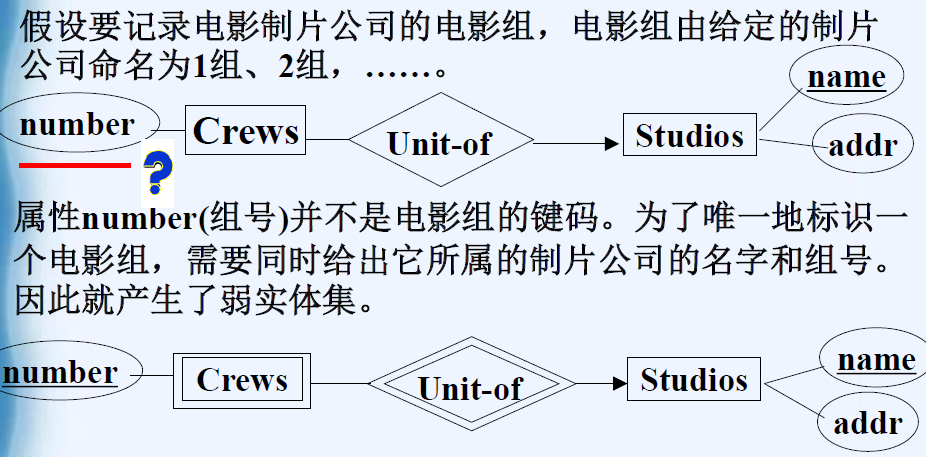
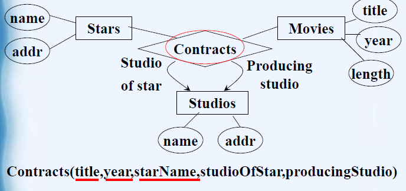

# 3 ER图

[TOC]

##  初级实体联系图

实体联系图（E/R图）：描述实体及实体间的联系。
构成：
①实体集：实体（客观存在并且可以相互区别的事物） 
②属性：描述实体某个特性的值。==属性的数据类型不能是**聚集类型**==
③联系：两个或多个实体集之间的连接关系
实例：
为银行建立数据模型，要求保存以下信息：
顾客：身份证号、姓名、地址和电话；
账号：编号、类型（例如存款、支票）和结余
记录顾客所拥有的的银行账号

**联系的特性：**
（1）多重性：

1. 一对一：两个实体集之间一对一对应，如：班级与班长
2. 一对多：实体集A中至少有一个实体对应B中的多个实体，B中的每个实体都唯一
3. 多对多：A中至少有一个实体对应B中的多个实体，B中至少有一个实体对应A中的多个实体
4. 表示方式：
   从E到F的一对一联系，分别画一个箭头指向E和F；
   从E到F的多对一联系，那么就画一个指向F的箭头。
   多对多联系，不需要使用箭头
   ==确定是否该划箭头的方法：如果这个联系可以唯一地确定该实体集中的一个实体，则连向该实体集的连线应该加箭头，否则不加==
   
5. 实体集中至少有几个属性？
   在联系中==包含多的一方只需要有一个属性==，==包含唯一的一方至少需要两个属性==
   

（2）多向性：联系涉及两个以上实体集
描绘电脑销售数据库，要求保存：
1）电脑销售公司：公司名称、地址、雇员、销售的电脑
2）销售公司雇员：雇员号、姓名、年龄。
3）电脑信息：型号、制造商、价格、销售编号。

（3）联系的角色：可以具有多种角色(一个实体集在一个联系中可以出现多次)

例子：
设计一个家谱数据库中的类Person，要求：
1）记录每个人的姓名。
2）记录联系：母亲、父亲和孩子。
对这个数据库用E/R进行描述

（4）联系中的属性：联系可以具有自己的属性

##  高级联系图

###  E/R图中的约束

（1）键码(keys)：在实体集的范围内唯一标识一个实体的属性或属性集
若一个实体集有多个键码：==主键码在图中用下划线表示，其他键码可在附注中表示==
（2）参照完整性约束：由某个实体引用的另一个实体集中的实体在数据库中确实存在
		假定R是一个从实体集E到实体集F的联系。如果E和F之间存在参照完整性，则用一个**指向F的圆箭头**来表明不仅联系R是由E到F的多对一或一对一的联系，而且**对于实体集E的一个给定实体，要求与之相关的实体集F的实体一定存在**。

​       注意到：多对一联系或一对一联系并不总要满足参照完整性约束
​       

（3）联系度的约束：如某名同学至少要有10门课程成绩
     把一个极限数附在联系和实体集的连线旁边，以表明限制与有关实体集的任何一个实体相连的实体数

**例题1：**为学校建立课程数据库，要求如下：
记录课程的信息：课程名称、课程学时数、课程所属系别和任课教师。
记录任课教师信息：姓名、性别、系别、所教课程。
每位任课教师最多只能讲授4门课程。
对这个数据库用E/R图进行描述，并且设计键码

**例题2：**为银行设计一个数据库，要求记录如下信息：
顾客的信息包括他们的姓名、地址、电话、社会保险号。
帐户包括编号、类型、结余和相应的顾客。
对这个数据库用E/R进行描述，并且设计键码。

### ER图中的子类

利用==isa联系==将类C和D的两个实体集相连。isa联系用两条直线和一个等腰三角形来表示。**三角形的顶点指向超类。**专用词“isa”放在三角形中。

**注：子类在ODL和E/R中有区别**
ODL中：对象必须是一个类的成员
==E/R模型中：一个实体可以属于几个实体集，它具有这几个实体集所有的属性==

如果要记录一类影片，既是卡通片，又是谋杀片，而且没有自己独有的特性，则**在E/R图中，不需要单独建立一个实体集**

例题：
用E/R描述军舰数据库。每艘军舰有信息：名称、排水量、类型。另外，有下列具有某些其他信息的特殊类型的舰艇:
炮舰：携带大型火炮的舰艇，记录主炮的数量和口径。
航空母舰：记录飞行甲板的长度和航空大队的集合。
潜艇：记录最大安全深度。
攻击型航空母舰：既是炮舰又是航空母舰

### E/R图中的弱实体集

弱实体集：如果组成一个实体集**键码的属性**中的**一些或全部属于另一个实体集**，那么这个实体集是~
**表示方法：**
（1）==用**双边矩形**表示一个实体集是弱的==。
（2）用**双边菱形**表示连接它和提供其键码属性的其他实体集的多对一联系。
（3）对为实体集提供键码的属性加下划线。

弱实体集不具有为它提供键码的实体集的所有属性。而子类具有超类的所有属性

**弱实体集的键码要求：**如果E是一个弱实体集，那么为E提供键码属性的每个实体集F必须通过联系R和E相连，并且
（1）R必须是从E到F的二元的**多对一的联系**。
（2）F为E的键码提供的属性**必须是F的键码属性**。
（3）若实体集F本身是弱实体集，那么F提供给E的键码属性包括为F提供键码属性的实体集的属性。
（4）如果有几个从E到F的多对一联系，那么每个联系将提供一次F的键码属性，共同构成E的键码。

**实例**
（1）实体集属于一种层次结构

（2)连接实体集

### E/R图与ODL的区别

（1）E/R模型中，联系作为独立的概念存在，而ODL中是作为特性嵌套在类定义中。
（2）ODL中，属性可以是任意的聚集类型。而E/R模型中通常认为数据类型不能是聚集类型。
（3）E/R模型中，联系可以具有属性，而ODL中没有相应的概念。
（4）E/R模型中有弱实体集的概念，而ODL中没有

##  实体联系图到关系模型的转换

### 非弱实体集

建立一个与之同名而且具有相同属性集的关系。注意该关系不包含任何联系的信息。
==联系转换到关系模型时也用关系表示。==给定联系R，对应的关系具有以下属性：
（1）联系R涉及到的每个实体集的键码属性或属性集
（2）联系R的属性
1.如果一个实体集在联系R中出现多次，==转换到关系时必须进行改名==，以免出现重名属性
2.对于来自实体集的关系，其键码就是实体集的键码。
3.对于来自二元关系的关系：
(1) 多对多联系：联系相连的两个实体集的键码都是关系R的键码属性
(2)从实体集**E1到E2的多对一联系**实体集**E1的键码是关系的键码**，而E2的键码则不是该关系的键码
(3)一对一联系联系的任何一个实体集的键码都是该关系的键码，即该关系有两个键码
4.如果关系R来自多向联系，若多向联系R有一个箭头指向实体集E，则转换后的关系中，除了E的键码以外，其他实体集的键码的集合就构成了这个关系的键码。

实例：
下面的E/R图表示舰艇。如果两艘舰艇是根据同一个方案设计制造的，就称它们为“姐妹"舰。把这个E/R图转换为关系数据库模式。

### 弱实体集

弱实体集W转换成关系，该关系既包含W的属性，也包含构成W的键码的其他实体集的键码属性。
与弱实体集W相连的非双菱形联系转换成关系，该关系必须包含W的所有键码属性。
与弱实体集W相连的双菱形联系，不需要转换成关系。
此过程中，必须注意属性不能重名

### “属于”联系到关系的转换

E/R中isa联系转换到关系时
（1）属于联系本身不需要建立相应的关系。
（2）对于子类，除了包含自己的属性集外，还应包含超类的键码。
（3）如果在元组中允许使用NULL值，就可以用单个关系来表示E/R图中的继承。

### 继承的转换

