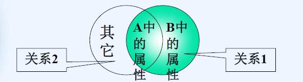
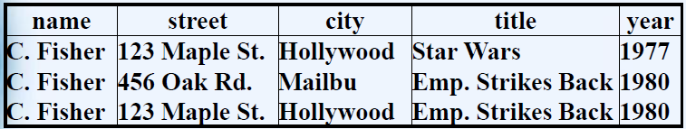
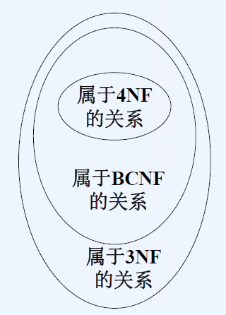

4 关系数据库规范

[TOC]

# 函数依赖

**定义：**如果关系R的两个元组在属性A1,A2,…An上一致，必然会有另一个属性B的取值一致，则属性A1,A2,…An与B之间存在着函数依赖，称A1,A2,…An函数决定B，并记作A1A2…An→B。
如果属性A1,A2,…An函数决定多个属性，A1A2…An→B1，…，A1A2…An→Bm，则可以把这一组依赖关系简记为：$A_1A_2…A_n→B_1B_2…B_m$

**分类：**对于函数依赖$A\rightarrow B$，如果：
1.B是A 的子集：平凡依赖
2.B中至少有一个属性不在A中：非平凡依赖
3.B中没有属性在A中：完全非平凡依赖

**(1)(2)分解规则与合并规则：**
函数依赖$A_1A_2…A_n→B_1B_2…B_m$，等价于一组函数依赖
$A_1A_2…A_n→B_i (i=1,2,…m) $。
**(3)平凡依赖规则：**
函数依赖$A_1A_2…A_n→B_1B_2…B_m$等价于$A_1A_2…A_n→C1C2…Ck$，其中C是B的子集，但C中的所有属性在A中都没有出现。
**(4)增长规则：**
如果$A_1A_2…A_n→B_1B_2…B_m$，则对于任何属性集$C_1C_2…C_k$，$A_1A_2…A_n C_1C_2…C_k→B_1B_2…B_m C_1C_2…C_k$
**(5)传递规则：**
如果函数依赖$A_1A_2…A_n→B_1B_2…B_m$和$B_1B_2…B_m→C_1C_2…C_k$在关系R中成立，则$A_1A_2…A_n→C_1C_2…C_k$在R中也成立
**例子：**
关系Movie(title,year,length,filmType,studioName,studioAddr)存在着函数依赖title year→studioName和studioName→studioAddr。
利用传递规则，可以得到一个新的依赖
title year→studioAddr。

## 关系的键码——是一个集合

键码：如果一个或多个属性的集合$\{A_1,A_2,…A_n\}$满足如下两个条件，就称**该集合为关系R的键码:**
（1）该**属性集合  函数决定  该关系的所有其他属性**。
（2）该属性集合的任何真子集都不能函数决定该关系的所有其他属性

超键码：包含键码的属性集                            
每个键码都是超键码，但超键码不一定是键码

## 属性集的闭包

假设$\{A_1,A_2,…,A_n\}$是属性集，S是函数依赖集。
==属性集$\{A_1,A_2,…,A_n\}$在依赖集S下的闭包是属性集$\{A_1,A_2,…,A_n\}$**所能函数决定的所有的属性的集合。**==用$\{A_1,A_2,…,A_n\}$+来表示。
明显：$A_1,A_2,…,A_n$总在$\{A_1,A_2,…,A_n\}$+中

###  如何计算闭包？

考虑一个具有属性A,B,C,D,E,F的关系。假设该关系有函数依赖
AB→C,BC→AD,D→E,CF→B。求{A,B}+。
1.设X={A,B},根据AB→C，得到第一次迭代后X={A,B,C}。
2.根据BC→AD，得到X={A,B,C,D}。
3.根据D→E，把E加入到X中，得到X={A,B,C,D,E}。
这时无法再扩展了，因此{A,B}+={A,B,8C,D,E}。
函数依赖CF→B没用上

### 闭包的利用1—检验函数依赖是否蕴含于函数依赖集

已知关系R(A,B,C,D,E,F)和函数依赖集(AB→C,BC→AD,D→E,CF→B)，检验AB→D和D→A是否蕴含于该函数依赖集
1.检验AB→D。首先计算{A,B}+：
由于{A,B}+={A,B,C,D,E}，D是集合{A,B}+的成员，因此AB→D蕴含于这些函数依赖
2.检验D→A。首先计算{D}+：
从X={D}开始计算，利用依赖D→E得到X={D,E}，
这时就不能扩展了，所以，{D}+={D,E}。由于A不是{D}+中的成员，因此，D→A并不蕴含于给定的函数依赖集

### 闭包的利用2—检验属性集是否是关系的键码

**首先计算{A1,A2,…,An}+，**如果包含该关系的所有属性，则属性集是关系的超键码。
然后检查从{A1,A2,…,An}中**删除任何一个属性构成的集合S**，计算S+。**如果S+不包含该关系所有的属性，就说明{A1,A2,…,An}是该关系的键码**
例：
考虑关系模式R(A,B,C,D)，假设R上存在函数依赖AB→C,C→D,D→A，求R的所有键码。
{A}+={A},{B}+={B},{C}+={A,C,D},{D}+={A,D}都不构成键码，则在这些属性上分别加上别的属性，求闭包看是否是键码。
{A,B}+={A,B,C,D},{A,C}+={A,C,D},{A,D}+={A,D},{B,C}+={A,B,C,D},{B,D}+={A,B,C,D},{C,D}+={A,C,D},因此{A,B}、{B,C}、{B,D}是键码。
则只需考察不包括这3个二属性集的由三个属性构成的属性集是否是键码。{A,C,D}+={A,C,D}不是键码。
因此该关系R有三个键码{A,B}、{B,C}、{B,D}。

## 关系的基

给定一个**函数依赖集**，如果**能从中导出关系的所有依赖**，就称这个**依赖集**为该关系的“基”
如果一个基的任何真子集都不能推导出该关系的所有的依赖，则称此基为“最小的”
**例**
假设关系R(A,B,C)的每个属性都函数决定其他两个属性。
则其函数依赖全集包括：
1.六个左、右各有一个属性的依赖:(A→B,A→C,B→A,B→C,C→A和C→B),
2.三个左边有两个属性的非平凡依赖:(AB→C,AC→B和BC→A)，
3.平凡依赖:(A→A等)，或者不是完全非平凡的依赖(AB→BC等)。
上面的关系有几个最小基。
一个是{A→B,B→A,B→C,C→B}，另一个是{A→B,B→C,C→A}。
上面的关系还有许多其他的基。

# 数据库规范

## 第一范式

如果一个关系模式R的每个具体关系r的每个属性值都是不可再分的最小数据单元，则称R为第一范式，简称1NF，r为1NF关系

例如：一个雇员关系模式中的“工资”，由“基本工资”和“奖金”组成，这样的关系模式就不是第一范式。

## 第二范式

**非主属性**：不包含在任何键码中的属性

满足第一范式的关系模式R，如果它的==所有**非主属性**都完全函数依赖于任一键码==，则称R是第二范式，记为2NF。

==右边是非主属性时，左边必须是键码；右边不是时，就不要求==
例：
Borrowers(Name,Addr,Title,Date)虽然是第一范式，但产生了冗余和潜在的更新异常，原因是Addr部分依赖于关键字Name和Title。
可以将其**分解**为：
Borrowers(Name,Addr)
Loans(Name,Title,Date)

### 关系分解？
把关系的属性采取适当的方式分开，以构成两个新的关系模式，而这种分解要求是可逆的

给定一个模式为R(A1,A2,…,An)的关系，可以把R分解为两个关系S和T，其关系模式分别为(B1,B2,…,Bm)和(C1,C2,…,Ck)，使得:
1.{A1,A2,…,An}={B1,B2,…,Bm}U{C1,C2,…,Ck}。
2.关系S中的元组是R的所有元组在{B1,B2,…,Bm}上的投影。
3.关系T中的元组是R的所有元组在{C1,C2,…,Ck}上的投影。
如果出现相同元组？
为保证分解是可逆的，必须要在一定的规则下进行关系的分解

## BC范式

如果关系R的所有非平凡依赖$A_1A_2…A_n→B$满足条件==“{A1,A2,…,An}是R的超键码”==，则关系R就属于BC范式(BCNF)
注：一个关系可能有多个键码。而BCNF只==要求某个键码包含在任何非平凡依赖的左边==，并不要求所有键码都包含在左边。

**不属于BCNF的例子**——NCNF严苛于二范式
Movie(title,year,length,filmType,studioName,starName)
{title,year,starName}是键码。因此，任何包含这三个属性的属性集都是超键码
考虑非平凡函数依赖：title year→length filmType studioName，左边不是超键码，因此，违背了BCNF条件。

**属于BCNF的例子**
Movie1(title,year,length,filmType,studioName)
因为非平凡函数依赖title year→length filmType studioName在该关系中成立，并且title或year本身都不能单独地函数决定其他任何属性，Movie1的唯一的键码是{title,year}。
而且，Movie1仅有的非平凡函数依赖的左边必定至少包含title和year，所以它们的左边必然是超键码。
因此，Movie1属于BCNF。

### 双属性关系

定理：==任何双属性关系都属于BCNF==
证明：假设这两个属性是A和B
情况1：没有非平凡依赖。则必然属于BCNF。因为只有非平凡依赖才可能违背BCNF条件。这种情形下，{A,B}是唯一的键码。
情况2：A→B成立，但B→A不成立。这种情形下A是唯一的键码，而且任何非平凡依赖的左边必定包含A(事实上，左边只能是A)。所以，没有违背BCNF条件。
情况3：B→A成立，但A→B不成立。与情形2对称
情况4：A→B和B→A都成立。则A和B都是键码。则任何依赖的左边都至少包含其中一个键码，没有违背BCNF条件。
因此，该定理成立。

### 分解为BCNF

通过不断地选择合适的分解，可以把任何关系模式分解成若干个关系，而这些关系都属于BCNF，并且能够准确地重构原始的关系。此时称关系被分解成了BCNF

分解策略：
1.寻找一个**违背BCNF**的**非平凡依赖A1A2…An→B1B2…Bm**，即**{A1,A2,…,An}不是超键码**。要求在右边加入由{A1,A2,…,An}函数决定的所有属性。
2.将原来的关系分解成两个模式，一个关系包含了违背BCNF的依赖中的所有属性，而另一个关系则包含了该依赖的左边以及未包含在该依赖中的所有属性。
3.循环做以上两步，直到所有模式都满足BCNF为止。

结论：
采取上面的分解策略最终必然可以成功地使所有的关系属于BCNF
按照BCNF分解方法对关系进行分解，则以所有可能的方式对新关系的元组进行连接，都可以准确地恢复原始关系。

### 实例

**例子1：**
考虑关系Movie(title,year,length,filmType,studioName,starName)。
title year→length filmType studioName是一个BCNF的违例。因此，该关系不属于BCNF。用这个BCNF违例把Movie分解成:

1. 包含该依赖所有属性的模式，即R1(title,year,length,filmType,studioName)
2. 包含**除了该依赖右边的三个属性之外的所有Movie属性的模式**。因此，除去length、filmType和studioName，得到了第二个模式：R2(title,year,starName)

这两个模式都属于BCNF。

**例子2：**
MovieStudio(title,year,length,filmType,studioName,studioAddr)的分解。{title,year}是它的键码。
存在函数依赖：title year→studioName和studioName→studioAddr
studioName→studioAddr是非平凡的，但它的左边并不是超键码。所以是BCNF违例。
分解后的第一个模式是该依赖自己的属性，即R1(studioName,studioAddr)。
第二个模式是除了studioAddr之外MovieStudio的所有属性。因此，另一个模式就是：R2(title,year,length,filmType,studioName)。

**例子4：**
考虑关系模式R(A,B,C,D)，假设R上存在函数依赖AB→C,C→D,D→A，判断该关系模式是否属于BCNF，如果不是，请进行关系分解直到分解后的关系满足BCNF。

**该关系R有三个键码{A,B}、{B,C}、{B,D}**（见闭包的利用2——寻找键码），非平凡函数依赖
C→A,C→D,D→A,AC→D,CD→A均为BCNF违例。
从C→A出发进行分解，首先得到R1(C,A)和R2(B,C,D)，后者有两个键码{B,C}、{B,D}，则C→D为BCNF违例，分解得到R3(C,D)和R4(B,C)。
R1(C,A)、R3(C,D)、R4(B,C)均属于BCNF。

### 函数依赖的投影

函数依赖的投影：对关系进行分解后会得到新的关系模式，原关系的函数依赖就会转变到新的关系模式中
假设把关系R分解为关系S和另一个关系。设F是已知的R中成立的依赖集。则计算S中成立的函数依赖的**步骤如下**:
考虑==包含于S的每个属性集X==。==计算X+==。对于满足下列条件的每个属性B，函数依赖X→B在S中成立：
（1）B是S的一个属性。
（2）B属于X+，而且B不属于X。
注：S的某个属性集中如果不包含任何给定依赖的左边，它就不能导出S的任何依赖。

**例子**：
例子1.设关系R(A,B,C,D)，R中的函数依赖为A→B和B→C。设S(A,C)是R经过某种分解得到的一个关系。计算S中成立的函数依赖

解：
原则上，必须计算S的属性集{A,C}的每个子集的闭包。
1.先考虑{A}+。很容易就能看出，该集合为{A,B,C}。由于B不在S的模式中，所以A→B不是S的一个依赖。C在S的模式中，所以依赖A→C在S中成立。
2.现在考虑{C}+。{C}+={C}
3.考虑{A,C}+，即{A,B,C}。由于除了在考虑{A}时已经得到的依赖之外，这个属性集没有引入任何新的依赖。
因此，A→C是关系S满足的唯一依赖。
注：在指出一个关系中存在的函数依赖时，==只需要指出完全非平凡依赖==。

例子2：
已知关系R(A,B,C,D,E)分解为S(A,B,C)和另一个关系。设R的函数依赖为AB→DE、C→E、D→C和E→A。求出S中存在的函数依赖并以最小基的形式给出

解：
1.考虑{A}+={A}，{B}+={B}，{C}+={A,C,E}。则C→A为S的函数依赖
2.考虑双属性子集。{A,B}+={A,B,C,D,E}，{A,C}+={A,C,E}, {B,C}+={A,B,C,D,E}。从而得到S的函数依赖AB→C和BC→A
所以，S中存在的非平凡函数依赖包括AB→C、BC→A和C→A。由于BC→A蕴含于C→A，因此AB→C和C→A是该关系的最小基

例子3：
考虑R(A,B,C,D,E)分解为S(A,B,C)和另一个关系。设R的函数依赖为A→D、B→E和DE→C。求出S中存在的函数依赖。

解
1.考虑{A}+={A,D}。由于D不在S的模式中，这个属性集没有为S引入任何依赖。
同样，{B}+={B,E}和{C}+={C}也没有为S引入函数依赖。
2.考虑双属性子集。{A,B}+={A,B,C,D,E}。从而得到S的一个函数依赖AB→C。
其他双属性子集都没有为S提供依赖。
所以，S中存在的函数依赖就是AB→C。

## 第三范式

当有些关系不属于BCNF,但不想做分解
如：
关系Booking(title,theater,city)，(电影名,正在上映该电影的电影院名,电影院所在的城市))，假设有函数依赖theater→city和title city→theater。则该关系有两个键码{title,city}和{theater,title}。
则theater→city就是一个BCNF的违例。根据该违例分解为两个关系模式：(theater,city)和(theater,title)。

### 定义

如果对于关系R中的任何非平凡依赖A1A2…An→B，它们满足条件：
或者A1A2…An是超键码，或者B是某个键码的组成部分。
则关系R就属于第三范式(3NF)

### 关系的分解

考虑关系模式R(A,B,C,D)，假设R上存在函数依赖AB→C,C→D,D→A，
1、判断该关系模式是否属于BCNF，如果不是，请进行关系分解直到分解后的关系满足BCNF。
2、判断该关系模式是否属于3NF，如果不是，请进行关系分解直到分解后的关系满足3NF。

分析：
由于该关系R有三个键码{A,B}、{B,C}、{B,D}，而非平凡函数依赖C→A,C→D,D→A,
AC→D,CD→A均为BCNF违例。从C→A分解得到关系模式(C,A)、(B,C,D)，
进一步由C→D将(B,C,D)分解为(B,C)、(C,D)，均属于BCNF。
该关系的任何非平凡函数依赖右边必然包含键码的一部分，因此属于3NF。

## 第四范式

### 多值函数的依赖

在关系R{A1A2…An，B1B2…Bm，C1C2…Ck}中，对于任意的一对元组t和u，假设它们在属性集A={A1A2…An}的所有属性上取值一致，如果总可以在R中找到一个元组v，使得:
（1）v和t,u在A上取值一致，
（2）v和t在B上取值一致，而且
（3）v和u在除了A和B之外R的所有属性上取值一致。
则称多值依赖A1A2…An==→→==B1B2…Bm成立。

例如：

存在多值依赖name→→street city

非平凡的多值依赖：
对关系R的多值依赖A1A2…An→→B1B2…Bm，如果：
1.B中的属性都不在A中;
2.A和B并未包含R的所有属性。
则该多值依赖是非平凡的。

和函数依赖一样，A中的某些属性出现在右边也是可以的。但通常假设多值依赖的A和B中的属性(左边和右边)是分开的，即B中不包含A中的属性。

### 多值依赖的规则

**平凡依赖规则**：如果多值依赖A1A2…An→→B1B2…Bm在某个关系中成立，则A1A2…An→→C1C2…Ck也成立，其中**C是B加上A中的一个或多个属性**。
反之，也可以从B中删除一些属于A的属性，并推导出多值依赖A1A2…An→→D1D2…Dr，其中D是在B中而不属于A的属性。

**传递规则**：如果多值依赖A1A2…An→→B1B2…Bm和B1B2…Bm→→C1C2…Ck在某个关系中成立，则A1A2…An→→C1C2…Ck也成立。

**每个函数依赖都是多值依赖**。如果A1A2…An→B1B2…Bm则A1A2…An→→B1B2…Bm

**互补规则**:如果A1A2…An→→B1B2…Bm是关系R的多值依赖，则R也满足多值依赖A1A2…An→→C1C2…Ck，其中C是不属于A,B的R的所有其他属性。

**交集规则**: 假设X,Y和Z是属性集，如果X→→Y并且X→→Z，则X→→(Y∩Z)。

### 第四范式的定义

如果关系R的所有非平凡的多值依赖A1A2…An→→B1B2…Bm，满足条件“{A1,A2,…,
An}是超键码”，则关系R就属于第四范式(4NF)

也就是说，如果一个关系属于4NF，则每个非平凡多值依赖实际上就是一个左边为超键码的函数依赖

==第四范式实际上是BCNF的广义形式==
由于每个函数依赖也是一个多值依赖。因此，每个BCNF的违例也是一个4NF的违例。
属于4NF的每个关系都必然属于BCNF。然而，属于BCNF的关系却不一定属于4NF。
例：关系模式Star(name,street,city,title,year)
该关系的唯一键码是所有五个属性，而且没有非平凡函数依赖。因此，它确实属于BCNF。
但是该关系违背了4NF条件。例如，name→→street city是非平凡的多值依赖，而name本身不是超键码。

### 双属性关系

定理：==任何双属性关系都属于第四范式==。
证明：假设这两个属性是A和B，
1.没有非平凡函数依赖，A→→B，则也不是非平凡的多值依赖。则必然属于4NF。
2.A→B成立，但B→A不成立。这种情形下A是唯一的键码，也没有非平凡的多值依赖。
3.B→A成立，但A→B不成立。与情形2对称。
4.A→B和B→A都成立。则A和B都是键码。也没有非平凡的多值依赖。没有违背4NF条件。
因此，该定理成立。

### 分解成第四范式

**4NF的分解步骤**：
1.首先找到一个4NF的违例，比如A1A2…An→→B1B2…Bm而{A1,A2,…,An}不是超键码。
2.然后把含有4NF违例的关系R的模式分解为两个模式:
（1）A和B中的属性。
（2）A中的属性以及既不属于A也不属于B的R的所有其他属性。
3.重复上面两步，直到分解后的模式全都属于4NF

**实例**

**例子 1**
以关系模式Star(name,street,city,title,year)为例，其中存在多值依赖name→→street city，是一个4NF的违例。
分解时，从这个多值依赖出发，分解为两个模式：一个模式只包含上面的多值依赖所涉及的三个属性，即为(name,street,city)，
另一个模式由该依赖的左边加上未在该依赖中出现的属性组成，即(name,title,year)。
这两个模式中都没有非平凡多值依赖，所以它们属于4NF

**例子 2**
已知关系模式R(A,B,C,D)，其中存在多值依赖A→→B和A→→C，判断是否属于BCNF和4NF，如果不属于，分别进行分解。
1、属于BCNF，因为该关系的键码是{A,B,C,D}，因此没有非平凡函数依赖。
2、不属于4NF，因为存在非平凡的多值依赖的左边没有包含键码。
从A→→B开始分解，则得到关系模式R1(A,B)和R2(A,C,D)
R2不属于4NF，从A→→C开始分解，则得到关系模式R3(A,C)和R4(A,D)。
因此，最后得到三个关系模式R1(A,B)、R3(A,C)和R4(A,D)

**例子3**

已知关系模式R(A,B,C,D)，其中存在多值依赖AB→→C和函数依赖B→D，判断是否属于BCNF和4NF，如果不属于，分别进行分解。
1、因为该关系的键码是{A,B,C}，因此函数依赖B→D是BCNF的违例，不属于BCNF。从B→D分解得到关系模式R1(B,D)和R2(A,B,C)。
2、不属于4NF，因为存在非平凡的多值依赖的左边没有包含键码。
从AB→→C开始分解，则得到关系模式R1(A,B,C)和R2(A,B,D)。
R2不属于4NF，从B→D开始分解，则得到关系模式R3(A,B)和R4(B,D)。
因此，最后得到三个关系模式R1(A,B,C)、R3(A,B)和R4(B,D)。

**例子4**
已知关系模式R(A,B,C,D,E)，其中存在多值依赖 A→→B,AB→→C和函数依赖A→D和AB→E，判断是否属于BCNF和4NF，如果不属于，分别进行分解。
该关系的键码是{A,B,C}
1、函数依赖A→D是BCNF的违例，不属于BCNF。从
AB→E分解得到关系模式R1(A,B,E)和R2(A,B,C,D)。
再从A→D分解R2得到关系模式R3(A,D)和R4(A,B,C)。因此，最后得到三个关系模式R1(A,B,E)、R3(A,D)和R4(A,B,C)。
2、不属于4NF，因为存在非平凡的多值依赖的左边没有包含键码。
从A→→B开始分解，则得到关系模式R1(A,B)和R2(A,C,D,E)。
R2不属于4NF，从A→D开始分解，则得到关系模式R3(A,D)和R4(A,C,E)。
因此，最后得到三个关系模式R1(A,B)、R3(A,D)和R4(A,C,E)。

## 范式间的关系

**隐含关系**

**比较**

|特性                   | 3NF        | BCNF | 4NF      |
| ----------------------------- | ---------- | -------- | -------- |
| 消除FD引起的冗余  | 大部分| 是   | 是   |
| 消除MVD引起的冗余 | 否     | 否  | 是  |
| 保持FD        | 是    | 可能| 可能 |
| 保持MVD        | 可能   | 可能| 可能 |

 
