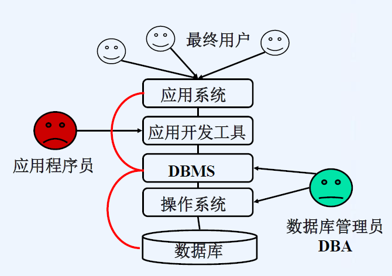
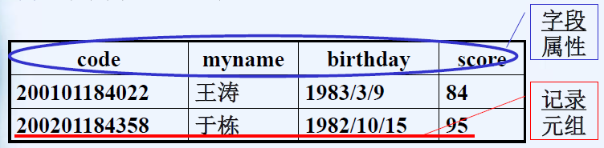
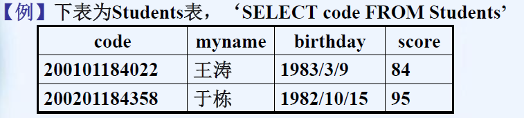
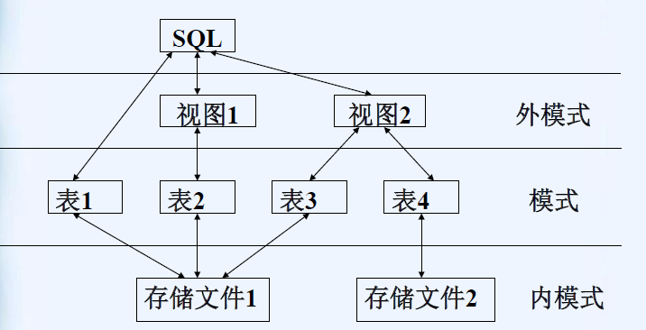

# 关系数据库

数据库系统的构成


常见的RDBMS有：DB2,Oracle,MSSQLServer等。
关系数据库中常见的对象：
(1)表（关系）

关系模式：对关系的描述，一般表示为：
关系名(属性1，属性2，……属性n)
其中加下划线表示这些属性的集合构成键码

(2)索引：为表建的一种实现快速查询的工具。可分为簇索引(聚集索引)和非簇索引(非聚集索引)。

+ 簇索引是行的物理顺序和行的索引顺序相同的索引。
  使用簇索引可以使UPDATE和SELECT操作大大加速。
  每个表只能有一个簇索引。
  定义簇索引键时使用的列越少越好。
+ 非簇索引是指定表的逻辑顺序的索引。行的物理顺序和索引顺序不尽相同。
  每个表可以建立多个非簇索引。

(2-1)簇索引：一般对符合下列情况的列建立簇索引：含有有限(但不是很少)数目唯一值的列，
例如某表中含有美国的50个州缩写名的列。
WHERE子句中含有“BETWEEN、>、>=、<=、<”运算符的查询列，
【例】SELECT\*FROMsale_tabWHEREord_dateBETWEEN'5/1/2003'AND'6/1/2003'
可能返回大结果集的查询列，
【例】SELECT*FROMphonebookWHERElast_name='Smith'
(2-2)非簇索引：对下列情况考虑使用非簇类索引：
1.含有大量唯一值的列。
2.返回很小的或单行结果集的查询。

(3)存储过程：多个SQL语句的有机的集合。
(4)触发器：一种特殊的存储过程，当满足一定的条件时，会触发它执行。多用来保证表中数据的一致性。
(5)视图：可以看成是虚拟表或存储查询。视图不作为独特的对象存储，数据库内存储的是SELECT语句。


# SQL 

## SQL的发展

SQL：结构化查询语言。
(1)1974年由CHAMBERLIN和BOYEE提出，叫SEQUEL(A Structured English Query Language)，IBM公司对其进行了修改，并用于其SYSTEM R关系数据库系统中；
(2)1976年推出了第二版本SEQUEL/S；
(3)1980年更名为SQL。
(4))1982年，ANSI (美国国家标准化组织)开始制定SQL标准，1986年，公布了SQL语言的第一个标准SQL86。1987年，ISO(国际标准化组织)通过了SQL86标准。
(5)1989年，ISO对SQL86进行了补充，推出了SQL89标准。
(6)1992年，ISO又推出了SQL92标准，也称为SQL2。
(7)目前SQL99(也称为SQL3)已完成，增加了面向对象的功能。
(8)SQL发展成了RDBMS的标准接口，被各RDBMS支持。
各RDBMS对SQL又有扩展。各厂商的扩展并无太大冲突。Transact SQL(简称T-SQL)就是Sybase公司的扩充版本。
本章将以MSSQLServer2000为背景来介绍T-SQL。

## SQL命令

数据定义命令DDL：包括创建、修改、删除数据库、表、索引、视图等，如CREATE、ALTER、DROP……。
数据修改命令DML：包括对数据的插入、删除和修改，如INSERT、DELEIE、UPDATE……。
数据查询命令DQL：即SELECT，可以实现选择、投影、连接等关系操作。
数据控制命令DCL：用于保证数据存取的安全性，如口令、授权等。
事务控制命令：用于保证数据的完整性、一致性、可恢复性等。

## SQL运作模式

SQL三级模式结构：


## 命名规则

必须以字母a-z 和A-Z、下划线(_)、at 符号(@) 或者数字符号(#)开头。
后续字符可以是：字母、十进制数字、@、#、美元符号($) 或下划线。
在SQL Server 中
(1)@开始的标识符表示局部变量或参数。
(2)以#开始的标识符表示临时表或过程。
(3)以双数字符号(# #) 开始的标识符表示全局临时对象。
(4)某些T-SQL 函数的名称以@@开始。为避免混淆这些函数，建议不要使用以@@开始的名称。
==标识符不能是保留字的大写和小写形式。==
==标识符不允许嵌入空格或其它特殊字符。==

**变量的声明和赋值**

变量的声明：DECLARE@local_variable data_type
变量在声明后均初始化为NULL。
给变量赋值：SET@local_variable=  或   SELECT@local_variable=
【例】
DECLARE@find varchar(30)
SET@find = 'Ring%'
SELECTau_lname, au_fname, phone FROMauthors WHEREau_lname LIKE@find
【例】
DECLARE@pub_id char(4), @hire_date datetime
SET@pub_id = '0877'
SET@hire_date = '1/1/2003'

## 数据类型

1.整数int从-231到231-1 的整数。

2.比特bit1 或0 的整数。

3.近似数字
float从-1.79E + 308 到1.79E + 308 的浮点精度数字。
real从-3.40E + 38 到3.40E + 38 的浮点精度数字。

4.字符串
char(n)固定长度的非Unicode字符数据，最长8,000 个字符。
varchar(n)可变长度的非Unicode字符数据，最长8,000 个字符。
不指定n，则默认长度为1。
:question:  Unicode字符
采用双字节对字符进行编码，有前缀N。
【例】'Michél'是字符串常量，N'Michél'则是Unicode常量。

5.日期
datetime从1753 年1 月1 日到9999 年12 月31 日的日期和时间数据，精确到百分之三秒(或3.33 毫秒)。
SQL Server 可以识别以下格式的日期和时间：
（1）字母日期格式:  【例】'April 15, 1998'
（2）数字日期格式: 数字分隔符数字分隔符，数字数字的顺序一般为mdy。
分隔符有斜杠（/）、连字符（-）或句号（.）。
【例】'4/15/1998'、'1990-10-02' 、'04-15-1996'
（3）未分隔的字符串格式:【例】'19981207'

## 基本运算

（1）+(字符串串联)将两个字符串串联到一个表达式中。
语法expression+ expression
参数image、ntext 或text 除外的字符和二进制数据类型。
两个表达式都必须具有相同的数据类型，或者其中的一个表达式必须能够隐式地转换为另一种数据类型。有时必须使用字符数据的显式转换(通过函数CONVERT或CAST)。
【例】SELECT (au_lname + ', ' + au_fname) AS Name FROM authors

（2）逻辑运算符=、>、<、>=、<=、<>、!<、!=、!>。
【例】WHERE price > (SELECT MIN(price) FROM titles)

（3）注释：--起头的
或者 / * text_of_comment* /
【例】--Choose the student’s database.

（4）BETWEEN指定测试范围。
语法test_expression[ NOT ] BETWEENbegin_expressionANDend_expression
【例】WHERE ypayment NOT BETWEEN 4095 AND 12000

（5）IN确定给定的值是否与子查询或列表中的值相匹配。
语法test_expression[ NOT ] IN(subquery| expression[ ,...n])
【例】WHERE state IN ('CA', 'IN', 'MD')
WHERE state = 'CA' OR state = 'IN' OR state = 'MD'
【例】WHERE au_id NOT IN
(SELECT au_id FROM author WHERE age < 50)

（6）LIKE确定给定的字符串是否与指定的模式匹配。
语法match_expression[ NOT ] LIKEpattern
【例】WHERE au_name LIKE 'Jo%'

（7）通配符
==%==匹配包含零个或多个字符的任意字符串。
==[ ]==匹配指定范围内或者属于方括号所指定的集合中的任意单个字符。
【例】WHERE au_lname LIKE '[A-C]arsen'
WHERE au_lname LIKE '[ABC]arsen'
【例】WHERE au_lname LIKE '50%'
WHERE au_lname LIKE '50[%]'
==[^]==匹配不处于指定范围内或者不属于方括号内指定集合中的任意单个字符。
【例】WHERE au_lname LIKE 'de\[\^a\]%'
【例】\[\^ab\]等价于\[\^a\^b\]表示一位字符不能是a或b。
\[\^a\]\[\^b\]表示两个相连字符相继不能是a和b。
==\_==匹配任意单个字符。
【例】WHERE au_fname LIKE '_ean'
WHERE au_fname LIKE '%ean'

（8）EXISTS(subquery)
如果子查询包含行，则返回TRUE。
子查询的SELECT 语句不允许有COMPUTE 子句和INTO 关键字。
【例】
SELECT DISTINCT pub_name
FROM publishers
WHERE EXISTS
(SELECT * FROM titles
WHERE pub_id = publishers.pub_id AND type = 'business')

（9）%(模)提供两数相除后的余数。
语法 dividend% divisor
参数 dividend 必须是整型。divisor可以是任何数字数据类型。
结果类型 int

（10）&(按位AND)在两个整型值之间执行按位逻辑与运算。
语法 expression& expression

（11）|(按位OR)将两个给定的整型值转换为二进制表达式，对其执行按位逻辑或运算。
语法  expression| expression

（12）~(按位NOT)将某个给定的整型值转换为二进制表达式，对其执行按位逻辑非运算。
语法~ expression

（13）ALL用标量值与单列集中的值进行比较。
scalar_exp 逻辑运算符ALL(subquery )
scalar_exp是任何有效的表达式。
subquery是返回单列结果集的子查询。返回列的数据类型必须与scalar_exp 的数据类型相同。而且该子查询SELECT 语句不允许使用ORDER BY 子句、COMPUTE 子句和INTO 关键字。
如果所有给定的比较对(scalar_exp, x)均为TRUE，其中x是单列集中的值，则返回TRUE；否则返回FALSE。

（14）SOME | ANY用标量值与单列集中的值进行比较。
scalar_expression{ = | < > | != | > | > = | ! > | < | < = | ! < } { SOME | ANY } ( subquery )
对于(scalar_expression, x)(其中x是单列集中的值)，当指定的比较有为TRUE的时，SOME 或ANY 返回TRUE。否则返回FALSE。

## 常用函数

**1.COUNT**    返回组中项目的数量。
语法COUNT( { [ ALL | DISTINCT ] expression | * } )
参数
(1)ALL 返回非空值的数量。缺省为ALL 。
(2)DISTINCT 指定COUNT 返回唯一非空值的数量。
(3)expression 一个表达式(一般为属性名)，其数据类型不能是text、image 或ntext。不允许使用聚合函数和子查询。
:exclamation:  COUNT(\*) 不能与DISTINCT 一起使用。返回包括NULL 值和重复值的数量。
【例】SELECT COUNT(DISTINCT city) FROM students
【例】SELECT COUNT(*) FROM courses

**2.SUM**      返回表达式中值的和。SUM 只能用于数字列。空值将被忽略。
语法SUM( [ ALL | DISTINCT ] expression )
参数
(1)ALL 对所有的值进行聚合函数运算。缺省为ALL。
(2)DISTINCT 指定SUM 返回唯一值的和。
(3)expression是常量、列或函数(bit数据类型的除外) 。
【例】SELECT SUM(score) FROM sScores

**3.AVG**	返回组中值的平均值。空值将被忽略。
语法AVG( [ ALL | DISTINCT ] expression )
【例】SELECT AVG(score) FROM sScores

**4.MAX**	返回表达式的最大值。
语法MAX( [ ALL | DISTINCT ] expression )
MAX 可用于数字列、字符列和datetime 列，但不能用于bit 列。
【例】SELECT MAX(age) FROM students

**5.MIN**	返回表达式的最小值。
语法MIN( [ ALL | DISTINCT ] expression )
MIN 可用于数字列、char 列、varchar 列或datetime列，但不能用于bit 列。
【例】SELECT MIN(age) FROM students

**6.字符处理**	常用的字符处理函数
（1）LOWER(char_expression )将大写转换为小写字符。
（2）UPPER(char_expression )将小写转换为大写字符。
（3）RIGHT(char_expre, integer_expre)返回从右边开始指定个数的字符。LEFT类似。
【例】SELECT '入学年份'=LEFT(st_id,4) FROM students
（4）SUBSTRING(expression,start,length )返回字符串的一部分。
【例】SELECT x = SUBSTRING('abcdef', 2, 3)
（5）LEN( string_expression )返回给定字符串表达式的字符个数，不包含尾随空格。
（6）REPLACE(‘string_exp1’,‘string_exp2’,’string_exp3’)用3替换1中出现的所有第2个给定字符串表达式。
（7）SPACE( integer_expression )返回指定数量的空格组成的字符串。

**7.日期处理**	常用的日期处理函数
（1）MONTH( date ) 返回代表指定日期月份的整数。
【例】SELECT "Month Number" = MONTH('03/12/2003')
:heavy_exclamation_mark: SQL Server 将0 解释为'01/01/1900'。
【例】SELECT MONTH(0), DAY(0), YEAR(0)
（2）GETDATE( )返回当前系统日期和时间。
【例】SELECT GETDATE()
【例】CREATE TABLE Score( stu_id char(11) NOT NULL, cos_name varchar(40) NOT NULL, exam_date datetime DEFAULT GETDATE() )

**8.ISNUMERIC**	( expression )判断是否为有效数字类型。

**9.ISDATE**	( expression )判断是否为有效的日期。

## 流程控制

**1.GO** 表示提交一批T-SQL语句。单独占行。

**2.BEGIN…END**	将一系列T-SQL语句作为一个组同时执行。可以嵌套。
语法	BEGIN
					{sql语句} 
			END
**3.WHILE**	设置循环语句的条件。
(1)只要指定的条件为真，就重复执行语句。
(2)可以使用BREAK和CONTINUE关键字在循环内部控制WHILE循环中语句的执行。
(3)语法
WHILE	Boolean_expression
{ sql语句}
[ BREAK]
{ sql语句}
[ CONTINUE]
【例】

```sql
WHILE(SELECT AVG(score) FROM st_score) <40
BEGIN 
	UPDATE st_score SET score = score *1.2
	IF (SELECT MAX(score) FROM st_score) >90
    	BREAK
   ELSE
   		CONTINUE
   END
```
如果平均成绩小于40分，则将st_score表中的成绩都乘以1.2。如果最高成绩大于90分，则中止。否则继续，直到平均成绩不再小于40分。
:exclamation: 超过一句的SQL语句块要用BEGIN…… END包含。

**4.IF…ELSE**	
语法：
IF Boolean_expression
{sql语句}
 [ ELSE
{sql语句} ]
【例】
IF (SELECT AVG(score) FROM st_score) < 80
BEGIN
		 PRINT '本课程成绩的最低分是'
			 SELECT MIN(score) AS Title FROM st_score
		END
 ELSE
	PRINT '本课程平均成绩超过80分'
（PRINT'字符串' 直接打印字符串给用户。）

**5.CASE** 	计算条件列表并返回多个可能结果表达式之一。
语法	
(1)简单CASE函数：
CASE input_expression
WHEN when_exp THEN result_exp\[ ...n ]
[ELSE sql语句]
END
(2) CASE搜索函数：
CASE 
WHEN Boolean_exp THEN result_exp\[ ...n ]
[ELSE sql语句]
END
返回第一个取值为TRUE 的result_exp。如果没有取值为TRUE 的，又没有指定ELSE 子句，则返回NULL 值。

```sq
SELECT'系别' =
CASE SUBSTRING(stu_id,7,3)
WHEN'184' THEN '控制系'
WHEN'181' THEN '电信系' 
ELSE'未知系别'
END, name AS Name FROMstudents
返回学生的系别名称和姓名。

SELECT'成绩' = 
CASE
WHEN score IS NULL THEN '未考'
WHEN score>=85 THEN '优秀'
WHEN score>=75 and score<85 THEN '良好'
ELSE'及格'
END, name FROMst_score
返回学生的成绩等级和姓名。
```

**6.WAITFOR**	指定触发语句块、存储过程或事务执行的时间、时间间隔或事件。
语法WAITFOR { DELAY 'time' | TIME 'time' }
参数
DELAY指示SQL Server一直等到指定的时间过去，最长可达24 小时。
'time'要等待的时间。不能指定日期。
TIME指示SQL Server 等待到指定时间。

**7.RETURN**	从查询或过程中无条件退出。不执行位于RETURN 之后的语句。
语法RETURN [ integer_expression ]

**8.GOTO**	 将执行流变更到标签处。跳过GOTO 之后的Transact-SQL 语句，在标签处继续处理。GOTO 语句和标签可在过程、批处理或语句块中的任何位置使用。GOTO 语句可嵌套使用。
语法    定义标签label :改变执行GOTO label

**9.ROLLBACK TRANSACTION** 滚回刚才执行的事务

**10.PRINT** '字符串' 	直接打印字符串给用户。

