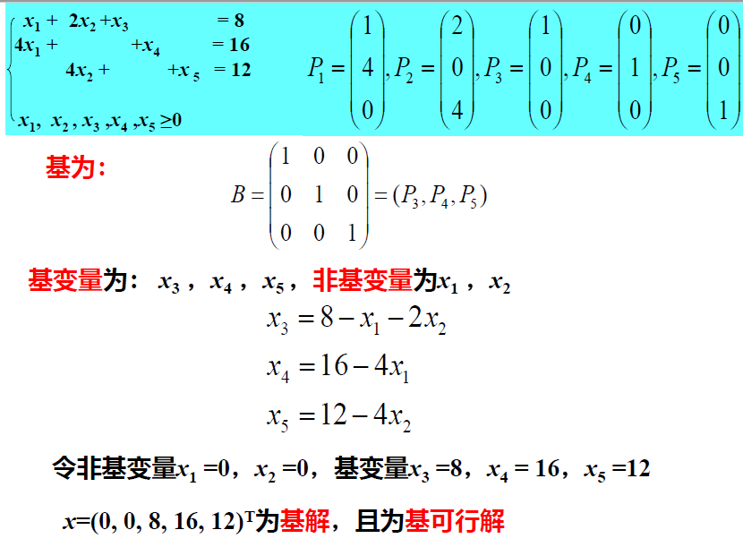
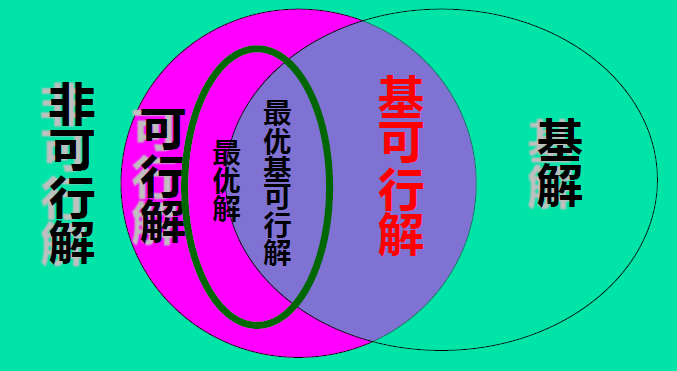
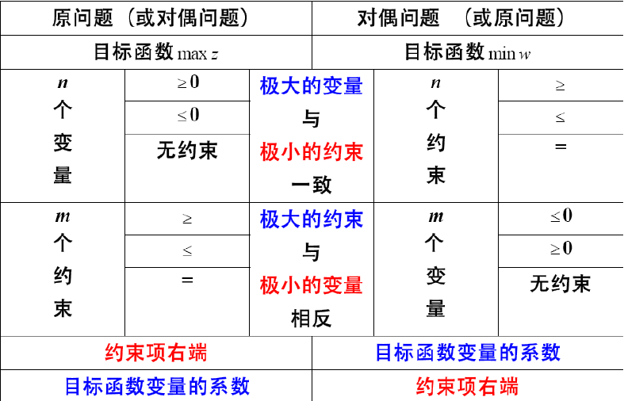
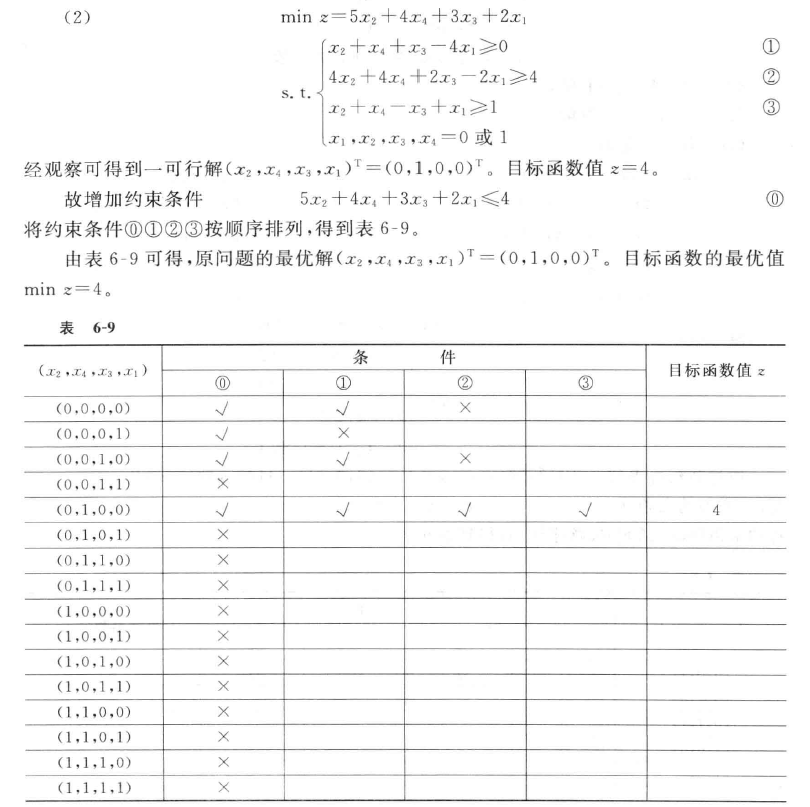
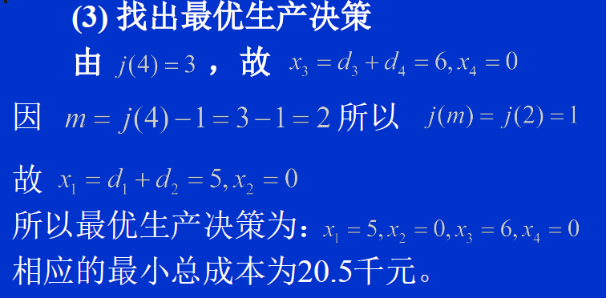
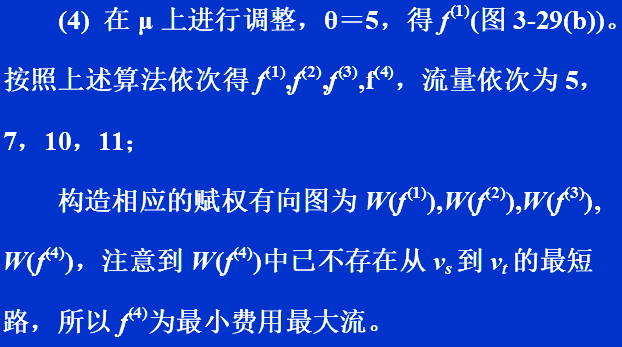

[TOC]

# 静态规划

### 1. 线性规划模型

#### 2.1 解的概念

+ 可行域、可行解

+ A的秩为m，假设是前m个列线性无关，则定义==基$B=（p_1,p_2,...p_m)$==

  由此定义出基变量与非基变量

+ 基可行解：既是基解又是可行解

  

+ 可行基：对应基可行解的基

+ 设是秩为的约束矩阵的一个阶满秩子方阵，则称为一个基；

  中个线性无关的列向量称为基向量，
  
  变量中与之对应的个分量称为基变量，其余的变量为非基变量，
  
  令所有的非基变量取值为0，得到的解称为相应于的基解。
  
  当则称基解为基可行解，这时对应的基阵为可行基。
  
  如果则称该基可行解为非退化的，如果一个线性规划的所有基可行解都是非退化的则称该规划为非退化的。
  
+ 

### 2. 单纯形法

#### 2.1 解形式的判断

| 形式 | 最优解                      | 无穷多最优解                                | 无界解                                |
| ---- | --------------------------- | ------------------------------------------- | ------------------------------------- |
| max  | 非基变量的$\sigma_j \leq 0$ | 最优解的前提下，存在非基变量的$\sigma_j$==0 | $\exists \sigma_j>0 \&\&a_{i,j}\leq0$ |
| min  | 非基变量的$\sigma_j \geq 0$ | 最优解的前提下，存在非基变量的$\sigma_j$==0 | $\exists \sigma_j<0 \&\&a_{i,j}\leq0$ |
|      |                             |                                             |                                       |

#### 2.2 选择基变换的准则

|        | 换入变量              | 换出变量                               |
| ------ | --------------------- | -------------------------------------- |
| 标准型 | $\sigma_j＞0$中的大者 | $\frac{b列}{x_k列}（x_k>0）$中的最小值 |
|        |                       |                                        |
|        |                       |                                        |

[注]：相同时取下标小的

+ 一道例题：

表1中给出某一求极大化问题的单纯形表，表中无人工变量，$a_1,a_2,c_1,c_2,d$为待定常数，试说明$a_1,a_2,c_1,c_2,d$分别取何值时，以下结论成立：
(1) 表中解为唯一最优解；
(2) 表中解为无穷多最优解之一；
(3) 下一步迭代将以x_1替换基变量x_5;
(4) 该线性规划问题具有无界解；

|           | $x_1$                                            | $x_2$  | $x_3$  | $x_4$ | $x_5$ |       |
| --------- | ------------------------------------------------ | ------ | ------ | ----- | ----- | ----- |
| $x_3$     |  | **4**  | $a_1$  | **1** | **0** | **0** |
| $x_4$     | **2**                                            | **-1** | **-5** | **0** | **1** | **0** |
| $x_5$     | **3**                                            | $a_2$  | **-3** | **0** | **0** | **1** |
| $c_j-z_j$ | $c_1$                                            | $c_2$  | **0**  | **0** | **0** |       |

答：
	表中解为唯一最优解:==$d≥0,c_1<0,c_2<0；$==
	表中解为无穷多最优解之一: $d≥0,c_1≤0,c_2≤0,c_1* c_2=0 ；$
	下一步迭代将以$x_1$替换基变量$x_5$: $d≥0,c_1>0,a_2>0,3/a_2 <d/4$
	该线性规划问题具有无界解:$d≥0,c_2>0,a_1  ≤0；$

### 3. 对偶理论与灵敏度分析

#### 3.1 对偶问题

#### 3.2 对偶理论的性质

+ **(1) 对称性：对偶问题的对偶是原问题**

+ **(2) 弱对偶性：若$\overline X$是极大化原问题的可行解,$\overline Y$是对偶问题的可行解。则$C\overline X \leq \overline Y b$**           

+ **(3) 无界性 ：若原问题为无界解，则其对偶问题无可行解**

+ **(4) 可行解是最优解时的性质:**

  **设$\widehat X$是原问题的可行解,$\widehat Y$是对偶问题的可行解，当$C\widehat X=\widehat Yb$时,$\widehat X,\widehat Y$是最优解。 **

+ **(5) 对偶定理 ：若原问题有最优解，那么对偶问题也有最优解；且目标函数值相等**

+ **(6) 互补松弛性：**

  **若$\widehat x,\widehat y$分别为原问题和对偶问题的可行解，那么$\widehat yx_s=0和y_s\widehat x=0$；当且仅当$\widehat x,\widehat y$为最优解。**

+ **(7) 原问题检验数与对偶问题解的关系：对偶问题的最优解是原问题松弛变量对应额检验数的相反数**

#### 3.3 影子价格

#### 3.4 对偶单纯形法

单纯形法：保持原问题的解是基本可行解，逐步迭代，使得对偶问题的解也是基本可行解，得到最优解

对偶单纯形法：保持对偶问题的解是基本可行解，逐步迭代，使得原问题的解也是基本可行解得到最优解

例子：

① 化为标准型求出一个基本解

② 构建单纯形表，检查b列与$\sigma$行

==若b列均非负，检验数均非正，则为最优解;==

==若b列存在负分量，检验数均非正，进行对偶单纯形法==

③ 确定出基变量：在==b列为负的b中选择最小值==，作为$x_l$

​             入基变量：==检查$x_l$行的$a_{ij}$，若所有的$a_{i j} \geq 0$，无可行解==

否则，==在$a_{i j}<0$中，计算$\frac{\sigma_j}{a_{i j}}$，最小值确定换入变量==

④ 迭代（$\sigma行一直保持\leq 0$）

⑤==对偶问题的解即为检验数所在行==

#### 3.5 灵敏度分析及其题目

+ 价值系数$c_j$

  + $c_j$是基变量的系数

    若要保证最优解不变，重新计算==所有的检验数==，则$\sigma_j \leq 0$需要成立

  + $c_j$是非基变量的系数

    若要保证最优解不变，计算==j对应的==$\sigma_j \leq 0$需要成立

+ 资源限量$b_j$

  + 问题1：求$b_r$的变化范围：

    利用$B^{-1}b（b列）+B^{-1}（a_{ij}中找）\Delta b \geq 0$

  + 问题2：改变$b_r$,求新最优解

    计算$B^{-1}b（b列）+B^{-1}（a_{ij}松弛变量中找）\Delta b$，并替换b列，再进行单纯形法或者==对偶单纯形法==

  + 问题3:从市场上购买原料$b_i$，原价为x,是否划算？

    看最终表检验数$b_i$对应的松弛变量的相反数，若x比其小则合算

+ 技术系数$a_j$

  | $c_j$ |       |      | 2     | 3     | 0           | 0              | 0         |            |
  | ----- | ----- | ---- | ----- | ----- | ----------- | -------------- | --------- | ---------- |
  | $C_B$ | $X_B$ | b    | $x_1$ | $x_2$ | $x_3$       | $x_4$          | $x_5$     | $\theta_j$ |
  | 2     | $x_1$ | 4    | 1     | 0     | ==**0**==   | ==**0.25**==   | ==**0**== |            |
  | 0     | $x_5$ | 4    | 0     | 0     | ==**-2**==  | ==**0.5**==    | ==**1**== |            |
  | 3     | $x_2$ | 2    | 0     | 1     | ==**0.5**== | ==**-0.125**== | ==**0**== |            |
  | -z    |       | -14  | 0     | 0     | -1.5        | -0.125         | 0         |            |

  + A矩阵增加一列

    设增加$x_k，技术向量P_k= (p_1,p_2,p_3)^T,检验数\sigma_k=c_k-C_BB^{-1}P_k$,若检验数>0,则安排此产品是有利的，其中$C_B B^{-1}$是检验数的绝对值

    计算$B^{-1}P_k(B^{-1}即为表中加粗部分)$即为$x_k的a_{ij}列$

    如增加$P_3=(2,6,3)^T，c= 5$，检验数=5-(1.5,1.125,0)(2,6,3)=1.25>0,有利的

  + A矩阵某一列改变

    $P_k变为P_k'$，计算$B^{-1}P_k'$为新的$a_{ij}$，以及新的检验数

  + ==注意：若经过迭代后发现，b列存在负数，检验数行存在整数，即原问题与对偶问题都没非可行解，加入人工变量处理==

    如$P_1'=(4,5,2)^T$,每件获利5元
    ，新检验数为$4-(1.5,0.125,0)(4,5,2)^T=-2.625$

    得到新表：

    

    ，然后将$x_1'$替换$x_1$为新的基变量

    

    发现原问题与对偶问题均是非可行解，需要加入人工变量，在$x_2$行加入人工变量$x_6$,

    $0x_1'+x_2+0.5 x_3-0.4x_4+0x_5=-2.4$就变成$-x_2-0.5x_3+0.4x_4+x_6=2.4$

    将$x_6$作为基变量填入表中

    

    之后就可以用单纯形法计算了

### 4. 运输问题

#### 4.1 数学模型

#### 4.2 表上作业法

(1) **找出初始基可行解**。即在(m×n)产销平衡表上用**最小元素法，Vogel法**给出**m+n-1**个数字，称为数字格
      **它们就是初始基变量的取值** 

+ 最小元素法：

  **找出最小运价，填入运送的表的对应位置，**并划去用完的行或列；

  依次循环（注意:有可能同时删除一行一列，进行补0处理）

+ ==Vogel法：==

  在算出各行各列==最小运费与次最小运费差额==，写在表格外一行一列

  选出行差或列差中选==最大==的，选择它所在行或列中的==最小元素==，进行填表

  循环

  注意问题：==退化==：有时会出现同时划去一行一列，则需要在这一行一列的某个格上放一个0

(2) **求各非基变量的检验数**，即在表上计算空格的检验数，判别是否达到最优解。如已是最优解，则停止计算，否则转到下一步

+ 闭回路法：

  **某空格为起点。用水平或垂直线向前划，当碰到一数字格时**可以转90°后，继续前进，直到回到起始空格为止

  

+ ==位势法==

  

  $先令u_0 = 0，利用c_{ij} 算出u_i与v_j，注意基变量的\lambda_{ij} = 0$

  而检验数$\lambda_{ij} = c_{ij}-u_i-v_j$,填入表中

  

  ==情况：==（1）非基变量检验数均非负：最优解；若存在某个基变量检验数为0：无穷最优解

(3) **定换入变量和换出变量**，找出新的基可行解。在表上**用闭回路法**调整

+ ==闭回路调整法：==

  如果还有负检验数，说明未得最优解，还可以改进；==操作的表格是伏格尔法中填入运量的表格==

  一般选其中**==最小==的负检验数**，以它对应的空格为调入格。即以它对应的非基变量为换入变量，**调入量θ是选择闭回路上具有(-1)的数字格中的最小者**，**然后按闭回路上的正、负号**，加入和减去此

(4) 重复(2)，(3)直到得到最优解为止

#### 4.3 产销不平衡

##### 1 产大于销:

 $\sum_{i=1}^m a_i > \sum_{j = 1}^n b_j$

增加虚拟销地，销量即为$\sum_{i=1}^m a_i - \sum_{j = 1}^n b_j$，单位运价为0

##### 2. 销大于产：

  $ \sum_{j = 1}^n b_j  > \sum_{i=1}^m a_i$

增加虚拟产地，销量即为  $ \sum_{j = 1}^n b_j  - \sum_{i=1}^m a_i$，单位运价为0

#### 4.4 笔记

##### **（1）利润最大问题：**

**找出表中最大利润，减去其他格中的利润，即化为运输问题**

##### **（2）退化问题**

**在进行伏格尔法时，同时删除一行一列，补0**

**在进行调整时，保证调整回路前后数字个数相同，不然要补0**

 **(3) 运费都翻一倍：最优运输方案不变**

​      **运费都加一定值：最优运输方案不变**

### 5. 目标规划

#### 5.1 目标规划的数学模型

+ 基础知识：

  + 设$x1，x2$为决策变量，引进正、负偏差变量$d^+，d^-$ 

    正偏差变量$d^＋$表示决策值超过目标值的部分，负偏差变量$d^-$表示决策值未达到目标值的部分

     因决策值不可能既超过目标值同时又未达到目标值，即恒有$d^+×d^-=0$

  + 要求第一位达到的目标赋予优先因子$P_1$，次位的目标赋予优先因子$P_2$, …, 并规定$Pk>>Pk+1, k=1, 2, …, K。$表示**$P_k比P_{k+1}$有更大的优先权**

    区别具有相同优先因子的两个目标的差别，这时可分别赋予它们不同的权系数$ω_j$

  + 目标函数只能是  $min\quad z=f(d^+,d^-)$

    ==可分为三类：==

    (1) 要求==恰好达到==目标值，即正、负偏差变量都要尽可能地小，这时

    $min\quad z=f(d^++d^-)$
    (2) 要求==不超过==目标值，即允许超过目标值，但正偏差变量要尽可能地小。这时
    $min\quad z=f(d^+)$
    (3) 要求==超过目标值==，即允许小于目标值，但必须是负偏差变量要尽可能地小，这时
    $min\quad z=f(d^-)$
    对每一个具体目标规划问题，可根据决策者的要求和赋予各目标的优先因子来构造目标函数 

+ 数学模型

#### 5.2 解目标规划的图解法

双变量：

#### 5.3 解目标规划的单纯形法

+ 目标规划问题的目标函数都是求最小化，所以==以$c_j-z_j≥0 (j=1, 2, …，n)$为最优准则==

+ 非基变量的检验数中含有不同等级的优先因子，即$c_j-z_j = \sum a_{kj}P_k$,$j = 1,2,...,n$$k = 1,2,...K$,从每个检验数的整体来看：检验数的正、负首先取决于$P_1$的系数$α_{1j}$的正、负,若$α_{1j}=0$，这时此检验数的正、负就取决于$P_2$的系数$α_{2j}$的正、负，其余可依此类推

+ 步骤：
  + (1) 建立初始单纯形表，在表中**将检验数行按优先因子个数分别列成K行，置k=1**
  
  + (2) 检查**该行中是否存在==负数==，且对应的前k-1行的系数是零**。若有负数取其中最小者对应的变量为换入变量，转(3)。若无负数，则转(5)
  
    注意，这里在选择换入变量是，如果上一行有正数，则检验数就是正的，不靠虑这个检验数的部分是不是负的
  
  + (3) 按**最小比值规则**确定换出变量，当存在两个和两个以上相同的最小比值时，选取**具有较高优先级别的变量为换出变量**
  
  + (4) 按单纯形法进行基变换运算，建立新的计算表，返回(2)
  
  + (5) 当k=K时，计算结束。表中的解即为满意解。否则置k=k+1，返回到(2)

### 6. 整数规划

#### 6.1 整数线性规划问题的提出

$$
max \sum_{j=1}^n c_jx_j\\
s.t.\sum_{j=1}^n a_{ij}x_j = b_i,ii=1,2,...,m\\
x_j\geq 0,j = 1,2,...,m  \quad 所有变量取整数
$$

#### 6.2 分支定界解法

+ 设有最大化的整数线性规划问题A，与它相应的线性规划为问题B，从解问题B开始，若其最优解不符合A的整数条件，那么B的最优目标函数必是A的最优目标函数z\*的上界，记作 $\overline{Z}$
  而A的任意可行解的目标函数值将是z\*的一个下界     
  分支定界法就是将B的可行域分成子区域(称为分支)的方法，逐步减小$\overline{Z}$和增大$\underline{Z}$，最终求到z*

+ 最通常的松驰问题是放弃变量的整数性要求
  整数规划的解集是其对应的线性规划解集的子集 
  整数规划求最大化时，线性规划的最优解是其解的上界
  整数规划求最小化时，线性规划的最优解是其解的下界

+ 分支的方法：

  任选一不符合整数条件的变量$x_r$，其值为$b_r$，构造两个约束条件$x_r≤[b_r]和x_r≥[b_r]+1$，将两个约束条件分别加入原问题，得两个后继规划问题

+ 定界

+ 剪枝

#### 6.3 割平面解法

纯整数线性规划的松弛问题时：去除整数要求

解题步骤：

+ 加入非负松弛变量，变为等式约束，用单纯形表解

+ 从==最终计算表中得到非整数变量对应的关系式==，从基变量的b列以及$a_{ij}$行得到

  

+ 将上式变量的==系数和常数项都分解成整数和非负真分数两部分之和，然后将整数部分与分数部分分开，移到等式左右两边==

  $(1+0)x_1+(-1+3/4)x_3+1/4 x_4=0+3/4\\x_2+(3/4)x_3+(1/4)x_4 = 1+3/4$

  $x_1-x_3 = 3/4-(3/4 x_3+1/4 x_4)\\x_2-1 = 3/4-(3/4 x_3+1/4 x_4)$

+ 利用等式约束构造割平面约束，得到一个割平面方程，加入约束，加入计算表中

  $3/4-3/4x_3+1/4x_4\leq0,即-3x_3-x_4\leq3,即-3x_3-x_4+x_5= -3$

+ 在根据新表进行==对偶单纯形法==

#### 6.4 0-1型指派问题

+ 变量$x_i$仅取值0或1。这时$x_i$称为0-1变量，或称二进制变量
+ ==找到一个可行解，将目标函数值作为约束加入约束里面，作为过滤的条件==
+ 将每个解依次验证约束条件，全部满足时得到目标函数值
+ 当遇到z值超过已有z值的情况，改变条件，进入第二步重新计算

#### 6.5 指派问题(极小化)

+ 某单位需完成n项任务，恰好有n个人可承担这些任务。由于每人的专长不同，各人完成任务不同(或所费时间)，效率也不同。于是产生应指派哪个人去完成哪项任务，使完成n项任务的总效率最高(或所需总时间最小)

+ 解法：

  + **第一步：**使指派问题的系数矩阵经变换，在各行各列中都出现0元素
    (1) 从系数矩阵的==每行元素减去该行的最小元素==
    (2) 再从所得系数矩阵的==每列元素中减去该列的最小元素==
    (3)若某行(列)已有0元素，那就不必再减了。

  + **第二步**：进行试指派，以寻求最优解
    需找出n个独立的0元素。若能找出，就以**这些独立0元素对应解矩阵(xij)中的元素为1，其余为0，这就得到最优解**

    + 当n较小时，可用观察法、试探法去找出n个独立0元素

    + 若n较大时，就必须按一定的步骤去找，常用的步骤为： 
      (1) 从==只有一个0元素的行开始，给这个0元素加圈，记作◎==.这表示对这行所代表的人，只有一种任务可指派。
               ==划去◎所在列的其他0元素，记作Φ==.这表示这列所代表的任务已指派完，不必再考虑别人了。
      (2) 给==只有一个0元素列的0元素加圈，记作◎；然后划去◎所在行的0元素，记作Φ==
      (3) 反复进行(1)，(2)两步，直到所有0元素都被圈出和划掉为止。

      (4) 若仍有没有划圈的0元素，且同行(列)的0元素至少有两个(表示对这个人可以从两项任务中指派其一)。

      ​      这可用不同的方案去试探。从==剩有0元素最少的行==(列)开始，比较这行各0元素所在列中0元素的数目，选择==0元素少的那列==的这个0元素加圈(表示选择性多的要“礼让”选择性少的)。

      ​      然后==划掉同行同列的其他0元素==。可反复进行，直到所有0元素都已圈出和划掉为止。
      (5) 若◎元素的数目==m等于矩阵的阶数n==，那么这指派问题的最优解已得到。若m＜n，则转入下一步。

  + **第三步：**作最少的直线覆盖所有0元素，以确定该系数矩阵中能找到最多的独立0元素。

    为此按以下步骤进行：
    (1) **对没有◎的行打√号**
    (2) **对已打√号的行中所有含Φ元素的列打√号**
    (3) **再对打有√号的列中含◎元素的行打√号**
    (4) 重复(2)，(3)直到得不出新的打√号的行、列为止
    (5) 对==没有打√号的行画一横线，有打√号的列画一纵线==，这就得到覆盖所有0元素的最少直线数，令这直线数为l。
    	若l＜n，说明必须再变换当前的系数矩阵，才能找到n个独立的0元素，为此转第四步
    	若l=n，而m＜n，应回到第二步(4)，另行试探。

  + **第四步：**
    为此在==没有被直线覆盖的部分中找出最小元素==。

    ==打√行各元素中都减去这最小元素，而在打√列的各元素都加上这最小元素==

    保证原来0元素不变。这样得到新系数矩阵

    若得到n个独立的0元素，则已得最优解，否则回到第三步重复进行。

# 动态规划

## （一） 动态规划的基本与原理与方法

### 1.多阶段决策过程与实例

+ 最短路径问题
+ 机器负荷分配问题

### 2. 动态规划基本概念

+ 阶段：阶段变量k=1,2,3...

+ 状态:每个阶段==开始时==所处的条件，一个阶段有若干状态，如{B_1,B_2}

  状态变量：$S_3=\{C_1,C_2,C_3,C_4\}$

  ==无后效性（马尔科夫性）：如果某个阶段状态给定后，则在这阶段以后的发展不收这阶段以前各阶段状态的影响。==

+ 决策：处于某个阶段的某个状态可以作出不同的决定

  ==决策变量：$u_k(S_k)$,k阶段状态处于$s_k$时的决策变量==

  允许决策集合：允许变量的范围   $u_k(S_k)\in D_k(S_k)$

  例如：$u_2(B_1) = C_2, D_2(B_1) = \{C_1,C_2,C_3,C_4\}$

+ 策略:按照一定顺序排列的决策

  k子过程策略：$p_{k,n}(S_k) = \{u_k(S_k),u_{k+1}(S_{k+1}),...u_n(S_n)\}$

  允许策略集合：$p$

+ ==状态转移方程:==

  ==$S_{k+1}随S_k和u_k$的确定而确定，$S_{k+1} = T_k(S_k,u_k)$==

+ 指标函数:衡量所实现过程优劣的数量指标

  $V_{k,n} = V_{k,n}(S_k,u_k,S_{k+1},...S_{n+1})，k=1,2,3,...n$

  ==最优值函数==:指标函数的最优值，从k阶段的状态S_k开始到第n阶段的终止状态的过程，，采取最优策略达到的指标函数值

  ==$f_k(S_k) = opt_{\{u_k,...u_n\}} V_{k,n}(S_k,u_k,...S_{n+1})$==

  指标函数的性质：

  + 可分离性，且满足递推关系：

    $V_{k,n}(S_k,u_k,S_{k+1},...S_{n+1}) = \Psi [S_k,u_k,V_{k+1,n}(S_{k+1},u_{k+1}...S_{n+1})]$

  常见指标函数：

  + 和的形式：

    $V_{k,n}(S_k,u_k,S_{k+1},...S_{n+1})=\sum_{j=k}^n \nu_j(S_j,u_j)\\V_{k,n}(S_k,u_k,S_{k+1},...S_{n+1})= \nu_k(S_k,u_k)+V_{k+1,n}(S_{k+1},u_{k+1}...S_{n+1})$

  + 积的形式

    $V_{k,n}(S_k,u_k,S_{k+1},...S_{n+1})=\prod_{j=k}^n \nu_j(S_j,u_j)\\V_{k,n}(S_k,u_k,S_{k+1},...S_{n+1})= \nu_k(S_k,u_k)*V_{k+1,n}(S_{k+1},u_{k+1}...S_{n+1})$

### 3. 动态规划基本原理

==最短路线有一个重要特性==：如果由起点A经过P点和H点而到达终点G是一条最短路线，则由点P出发经过H点到达终点G的这条子路线，对于从点P出发到达终点的所有可能选择的不同路线来说，必定也是最短路线

#### 3.1动态规划的基本方程

即==逆递推关系式==：

==$f_k(S_k) = opt_{u_k \in D_k(S_k)}\{\nu_k(s_k,u_k(s_k))+f_{k+1}(u_k(S_k))\},k=n,n-1,...,1$==

==边界条件：$f_{n+1}(S_{n+1}) = 0$==

#### 3.2 动态规划的基本思想

根据基本方程，从边界条件开始，逐段递推寻优，在每一个子问题的求解中，均利用了它前面的子问题的最优化结果，依次进行，最后一个子问题所得的最优解，就是整个问题的最优解。

#### 3.3 建立动态规划模型的五个要点

+ (1)  将问题的过程划分成恰当的阶段；

+ (2) 正确选择==状态变量$s_k$==，使它既能描述过程的演变，又要满足无后效性；

+ (3) 确定==决策变量$u_k$==及每阶段的允许决策集合$D_k(s_k)$；

+ (4) 正确写出==状态转移方程==；

+ (5) 正确写出==指标函数$V_{k,n}$==的关系，它应满足下面三个性质：

  ① 是定义在==全过程和所有后部子过程==上的数量函数；

  ② 要具有可分离性，并满足递推关系,即$V_{k,n}(S_k,u_k,S_{k+1},...S_{n+1}) = \Psi [S_k,u_k,V_{k+1,n}(S_{k+1},u_{k+1}...S_{n+1})]$

  ③ 函数$\Psi [S_k,u_k,V_{k+1,n}(S_{k+1},u_{k+1}...S_{n+1})]$对于变量$V_{k+1,n}$要严格单调。
        

### 4. 与其他方法的比较

#### 4.1 与穷举法比较

+ 减少了计算量

+ 丰富了计算结果

  得到的不仅仅是由A点出发到G点的最短路线及相应的最短距离，而且得到了从所有各中间点出发到G点的最短路线及相应的距离。这就是说，求出的不是一个最优策略，而是一族的最优策略。

#### 4.2 与静态规划比较

+ 相同点:研究对象本质上都是求极值问题，都是利用迭代法去逐步求解。
+ 不同点：与时间有关，具有多阶段决策过程的一类问题

### 5. 动态规划的理论基础

####  ==最优性定理==

“作为整个过程的最优策略具有这样的性质：即无论过去的状态和决策如何，对前面的决策所形成的状态而言，余下的诸决策必须构成最优策略。”

简言之，一个最优策略的子策略总是最优的。

对于阶段数为n的多阶段决策过程，$p^*_{0,n-1} = (u_0^*,u_1^*,...,u_{n-1}^*)$为最优策略的充要条件是对任意一个$k(0<k<n-1),s_0\in S_0$ ，有$V_{0,n-1}(S_0,p^*_{0,n-1}) =$$opt_{p_{0,k-1}\in p_{0,k-1}(S_0)} \{ V_{0,k-1}(S_0,p_{0,k-1})+$
$opt_{p_{k,n-1}\in p_{k,n-1}(\widetilde S_k)}V_{k,n-1}(\widetilde S_k,p_{k,n-1})\qquad  \}$

上式中，$p_{0,n-1} = (p_{0,k-1},p_{k,n-1}),\widetilde S_k = T_{k-1}(S_{k-1},u_{k-1})$

### 6. 动态规划的具体解法

#### 6.1 逆推解法

+ 基本方程：

  ==$f_k(S_k) = opt_{u_k \in D_k(S_k)}\{\nu_k(s_k,u_k(s_k))+f_{k+1}(u_k(S_k))\},k=n,n-1,...,1$==

  ==边界条件：$f_{n+1}(S_{n+1}) = 0$==

  其中$S_{k+1} = T_k(S_k,u_k)$

+ 求解过程：

  根据边界条件，从k=n开始，由后向前逆推，从而逐步可求得各段的最优决策和相应的最优值，最后求出$f_1(S_1)$时，就得到整个问题的最优解。

+ 算例

#### 6.2 顺推解法

+ 基本方程

  ==$f_k(S_{k+1}) = opt_{u_k \in D_k(S_k)}\{\nu_k(s_{k+1},u_k)+f_{k-1}(S_k)\},k=1,2,3...,n$==

  ==边界条件：$f_0(S_1) = 0$==

  其中$S_k= T_k^r(S_{k+1},u_k)$

+ 求解过程：

  根据边界条件，从k=1开始，由前向后顺推，逐步求得各段的最优决策和相应的最优值，最后求出$f_n(S_{n+1})$，就得到整个问题的最优解。

#### 6.3 算例

求解下列问题   

$max\quad z=x_1*x_2^2*x_3\\\begin{cases}x_1+x_2+x_3=c(c>0)\\x_i\geq0,i=1,2,3\end{cases}$

## （二）动态规划应用

### 1. 资源分配问题

#### 1.1 资源分配问题---设备分配工厂问题--逆推

+ 设有某种原料，总数量为$a$，用于生产$n$种产品。若分配数量$x_i$用于生产第$i$种产品，其收益为$g_i(x_i)$，问应如何分配，才能使生产$n$种产品的总收入最大?

+ 把资源分配给一个或几个使用者的过程作为一个阶段，把问题中的变量$x_i$为决策变量，将累计的量或随递推过程变化的量选为状态变量

+ 设

  ==状态变量$s_k$表示分配用于生产第$k$种产品至第$n$种产品的原料数量；==

  ==决策变量$u_k$表示分配给生产第$k$种产品的原料数，即$u_k=x_k$ ；==

  ==状态转移方程：$S_{k+1} = S_k-u_k = S_k-x_k$==

  允许决策集合：$D_k(S_k)=\{u_k|0\leq u_k=x_k\leq S_k\}$

  ==盈利值$P_k(x_k)$表示$x_k$台设备分配到第k个工厂所得的盈利值==

  最优值函数$f_k(s_k)$表示==以数量为$s_k$的原料分配给第$k$种产品至第$n$种产品所得到的最大总收入==，==动态规划的逆推关系式==为：

  $f_{k}(s_k) = max_{0\leq x_k\leq s_k}\{P_k(x_k)+f_{k+1}(s_k-x_k)\},k=n-1,...1\\f_n(s_n) = max_{x_n\leq s_n}P_n(x_n)$

  逐段求解可求得$f_1(a)$

#### 1.2 连续分配---机器负荷分配问题---逆推

+ 设有数量为$s_1$的某种资源，可投入A和B两种生产。第一年若以数量$u_1$投入生产A，剩下的量$s_1−u_1$就投入生产B，则可得收入为$g(u_1)+h(s_1-u_1)$
  其中$g(u_1)和h(u_1)$为已知函数，且$g(0)=h(0)=0$。这种资源在投入A、B生产后，年终还可回收再投入生产。
  设年回收率分别为$0<a<1和0<b<1$，则在第一年生产后，回收的资源量合计为$s_2=au_1+b(s_1-u_1)$， 第二年再将资源数量$s_2中的u_2和s_2− u_2$分别再投入A、B两种生产，则第二年又可得到收入为 $g(u_2)+h(s_2-u_2)$,如此继续进行n年，试问：应当如何决定每年投入A生产的资源量?

+ ==$s_k$为状态变量，表示在第k阶段(第k年)可投入A、B两种生产的资源量==

  ==$u_k$为决策变量，它表示在第k阶段用于A生产的资源量，则$s_k−u_k$表示用于B生产的资源量==

  ==状态转移方程为$S_{k+1} = au_k+b(s_k-u_k)$==

  ==最优值函数$f_k(s_k)$表示有资源量$s_k$，从第k阶段至第n阶段采取最优分配方案进行生产后所得到的最大总收入==

  所以==动态规划的逆推关系式==为：

$$
\begin{cases}
f_n(s_n) = max_{0\leq u_n\leq s_n}\{g(u_n)+h(s_n-u_n)\}\\f_k(s_k) = max_{0\leq u_k\leq s_k}\{g(u_k)+h(s_k-u_k)+f_{k+1}[au_k+b(s_k-u_k)]\},k=n-1,..2,1
\end{cases}
$$

$f_1(s_1)$即为总收入

##### ==相关讨论==

讨论始端固定、终端自由的一般情形。设有*n*个年度，在高、低负荷下生产的产量函数分别为$g=cu_1,h=du_2,其中c,d>0,c>d.$年回收率分别为a和b，其中$0<a<b<1$。

状态转移方程：$s_{k+1}=au_k+b(s_k-u_k),k=1,2,,...,n$

k阶段的指标函数：$v_k=cu_k+d(s_k+u_k),k=1,2,..n$

令$f_k(s_k)$表示由状态$s_k$出发，从第$k$年至第$n$年末时所生产的产品的总产量最大值

$\begin{cases}f_{n+1}(s_{n+1})=0\\f_k(s_k) = max_{0\leq u_k\leq s_k}\{c u_k+d(s_k-u_k)+f_{k+1}[au_k+b(s_k-u_k)]\},k=1,2,...n\end{cases}$

**前几年一般是全部用于低负荷生产，后几年则全部用于高负荷生产，这样才产量最高**

如果总共为n年，从低负荷转为高负荷生产的是第$t$年，$1≤t≤n$。也就是说，**从1至t−1年在低负荷下生产，t至n年在高负荷下生产。**

现在要分析t与系数**a、b、c、d**是什么关系。

从回收率看，(b−a)值愈大，表示在高负荷下生产时，机车损坏情况比在低负荷时严重得多，因此t值应选大些。

从产量看，(c−d)值愈大，表示在高负荷下生产较有利，故t应选小些。

经计算：只要满足极值条件式$c-d>c(1+a)(b-a)$，就应该在高负荷生产

==一般结果：先连续低负荷t-1年，t年转入高负荷生产，应满足的极值关系的条件：==

==$\begin{cases}c-d>c(1+a+a^2+...+a^{n-(t+1)})(b-a)\\c-d<c(1+a+a^2+...+a^{n-t})(b-a)\end{cases}$==

例如，例子中，$a=0.7,b=0.8,c=8,d=5,\frac{c-d}{c(b-a)}=1.875>(1+a)=1.7$
$n-t-1=5-t-1=1,t=3$

则第三年开始全部进行高负荷生产

### 2. 生产与储存问题

#### 2.1 生产计划问题---顺推

+ 设某公司对某种产品要制定一项n个阶段的生产(或购买)计划。已知它的**初始库存量为零**，**每阶段生产该产品的数量有上限的限制**；**每阶段社会对该产品的需求量是已知的**，公司保证供应；**在n阶段末的终结库存量为零。**问该公司如何制定每个阶段的生产计划，从而使总成本最小。

+ 解题初始设定：

  ==$d_k$为第k阶段对产品的需求量，$x_k$为第k阶段该产品的生产量，$v_k$为第k阶段结束时的产品库存量，则有$v_k=v_{k-1}+x_k-d_k$==

  ==$c_k(x_k)$表示第k阶段生产产品$x_k$时的成本费用==，==它包括生产准备成本$K$和产品成本$ax_k$====(其中a是单位产品成本)两项费用==，即$c_k=\begin{cases}0 & x_k=0\\K+ax_k & x_k=1,2,..m\\ \infty & x_k>m  \end{cases}$,m表示每阶段最多能生产该产品的上限数

  ==$h_k(v_k)$表示在第k阶段结束时有库存量$v_k$所需的存储费用==，k阶段的成本费用：$c_k(x_k)+h_k(v_k)$

  动态规划的顺序递推关系:   $f_k(v_k)=min_{0\leq x_k\leq \sigma_k}[c_k(x_k)+h_k(x_k)+f_{k-1}(v_k+d_k-x_k)],k=2,3,4\\其中\sigma_k=min(v_k+d_k,6)\\边界条件f_1(v_1)=min_{x_1=min(v_1+d_1,m)}[c_1(x_1)+h_1(x_1)]$

==计算步骤：==

当k=1时，$f_1(v_1)=min_{x_1=min(v_1+2,6)}[c_1(x_1)+h_1(v_1)]$,对$v_1\in(0,min[\sum_{j=2}^4d_j,m-d_1])=(0,4)$进行计算

$v_1=0:f_1(0)=min_{x_1=2}[3+0.5*0]=5,x_1=2\\v_1=1:...\\v_1=2:...\\v_1=3:...\\v_1=4:...$

当k=2,$f_2(v_2)=min_{0 \leq x_2 \leq \sigma_2}[c_2(x_2)+h_2(x_2)+f_1(v_2+d_2-x_2)]$ $\sigma_2=min(v_2+d_2,6),对v_2在0~min[\sum_{j=3}^4d_j,m-d_2]$进行计算

当k=3...

当k=4...$v_4=0,h(v_4)=0$

再顺序反推算

#### 2.2 ==再生产点性质==

+ 如果对每个i，都有$v_{i-1}x_i=0$，则称==该点的生产决策(或称一个策略$x=x_1,...x_n$ )具有再生产点性质。如果$v_i=0$，则称阶段i为再生产点==

+ 已知$v_0与v_n=0$，0与n是再生产点

+ ==若库存问题的目标函数g(x)在凸集合S上是凹函数(或凸函数)，则g(x)在S的顶点上具有再生产点性质的最优策略==

  在实例中，目标函数就是$c_k(x_k)+h_k(v_k)$

+ ==运用再生产点性质来求库存问题为凹函数的解：==

  + 设$c(j,i) (j≤i)$为阶段j到阶段i的总成本，给定$j−1和i$是再生产点，并且阶段j到阶段i期间的产品全部由阶段j供给，则==$c(j,i) = c_j(\sum_{s=j}^id_s)+\sum_{s=j+1}^i c_s(0)+\sum_{s=j}^{i-1}h_s(\sum_{t=s+1}^id_t)$==

    注：_j到 i的总成本=j阶段生产的成本（这一部分的全部由j生产）+剩余阶段的生产成本（不生产：0）+储存成本（j到i-1阶段结束需要储存，储存量是s+1阶段到i阶段的数量和）_

  + 设最优值函数$f_i$表示在阶段i末库存量$v_i=0$时，从阶段1到阶段i的最小成本，则对应的递推关系式为==$f_i=min_{1\leq j \leq i}[f_{j-1}+c(j,i)](式2-7)$,边界条件是$f_0=0$==

  + 为了确定最优生产决策，逐个计算$f_1,f_2,..f_n$,则$f_n(0)$为n个阶段的最小总成本

  + 设$j_n$计算$f_n$时，使(2-7)式右边最小的j值，即$f_i=min_{1\leq j \leq i}[f_{j-1}+c(j(n),i)]$

  + 所以，从==阶段$j(n)$到阶段n的最优生产决策为==：==$x_{j(n)}=\sum_{s=j(n)}^n d_s$====$x_s=0 当s=j(n)+1,j(n)+2,...n时$。==

    故$j(n)-1$为再生产点

  + 为了进一步确定阶段$j(n)−1$到阶段1的最优生产决策，记$m=j(n)−1$，而$j(m)$是在计算$f_m$时，使(2-7)式右边最小的j值，则从阶段j(m)到阶段j(n)的最优生产决策为：$x_j(n)=\sum_{s=j(m)}^m d_s$$x_s=0 当s=j(m)+1,j(m)+2,...m时$故$j(m)-1$为再生产点

+ 算例：

  | 1    | 2    | 3    | 4    |
  | ---- | ---- | ---- | ---- |
  | 2    | 3    | 2    | 4    |

  （1）计算$c(j,i),1\leq j \leq i,i=1,2,3,4$

  

  （2）计算$f_i与j(i)$

  

  （3）找出最优生产决策：利用$j(i)$

  

# 图与网络优化

### 1. 图论概述及基本概念

基本概念：

+ 图、边、弧、无向图$(G=(V,E))$,有向图$(D=(V,A))$,图G,D中的点数记为$p(G),p(D)$，边数或弧数记为$q(G)或q(D)$

+ 关连边、环、多重边（两个点之间有多于一条的边）

+ 简单图、多重图

+ 次：以点v为端点的边的个数$d_G(v)或d(v)$

  + 次为1的点为悬挂点，悬挂点的关连边为悬挂边
  + 次为0的边为孤立点
  + 次为奇数的点为奇点，否则：偶点

+ 关于次的结论：

  + 图$G=(V,E)$中，所有次之和是边数的两倍
  + 图中奇点的个数是偶数个

+ **给定一个图$G=(V,E)$和一个点、边交错序列$({v_i}_1,{e_i}_1,{v_i}_2,...,{v_i}_{k-1},{e_i}_{k-1},{v_i}_k)$,                                       , 如果满足${e_i}_t=[{v_i}_t，{v_i}_{t+1}],t=1,2,3,..k-1$,则称为一条链接${v_i}_1与{v_i}_k$的链，记为：$({v_i}_1,{v_i}_2,...,{v_i}_{k-1},{v_i}_k)$,${v_i}_1,{v_i}_2,...,{v_i}_{k-1},{v_i}_k$为链的中间点**

  **若链中，${v_i}_1={v_i}_k$，称为圈；**

  **若链中，点都是不同的：初等链**

  **若圈中，点都是不同的：初等圈**

  **若链（圈）中边均不想相同：简单链（圈）**

+ 连通图、连通分图、支撑子图

+ 基础图：有向图去除箭头

### 2.树

#### 2.1 树的概念

==无圈的连通图：树==

#### 2.2 相关结论

+ 定理3  设图G=(V，E)是一个树，p(G)≥2，则G中至少有两个悬挂点。
+ 定理4  图G=(V,E)是一个树的充分必要条件是G不含圈，且恰有p−1条边。
+ 定理5  图G=(V,E)是一个树的充分必要条件是G是连通图，且恰有p−1条边。
+ 定理6 图G=(V,E)是树的充分必要条件是任意两个顶点之间恰有一条链。

#### 2.3 图的支撑树

设图T=(V,E′)是图G=(V,E)的支撑子图，如果图T=(V,E′)是一个树，则称T是G的一个支撑树。

+ 定理7 图G有支撑树的充分必要条件是图G是连通的。

==求图的支撑树的方法：==

+ 破圈法：任取一个圈，从圈中去掉一边，对余下的图重复这个步骤，直到不含圈时为止，即得到一个支撑树
+ 避圈法：在图中任取一条边$e_1$，找一条与$e_1$不构成圈的边$e_2$，再找一条${e_1,e_2}$与不构成圈的边${e_3}$,重复这个过程，直到不能进行为止。这时，由所有取出的边所构成的图是一个支撑树
+ 在“破圈法”中去掉的边数必是q(G)-p(G)+1条，在“避圈法”中取出的边数必定是p(G) -1条。

#### 2.4 最小支撑树

给定图G=(V，E)，对G中的每一条边$[v_i,v_j]$，相应地有一个数$w_{ij}$，则称这样的图G为赋权图，$w_{ij}$称为边$[v_i,v_j]$上的权。

如果T=(V，E′)是G的一个支撑树，称E′中所有边的权之和为支撑树T的权，记为w(T)，即$w(T)=\sum_{[v_i,v_j]\in T}w_{i,j}$

如果支撑树T\* 的权w(T\*)是G的所有支撑树的权中最小者，则称T*是G的==最小支撑树(简称最小树)==。即$w(T ^ * )=min_{T}w(T)$     ,式中对G的所有支撑树T取最小。

==求图的最小支撑树的方法：==

+ 破圈法：**任取一个圈**，从圈中去掉**权最大的一边**，对余下的图重复这个步骤，直到不含圈时为止，即得到一个最小支撑树
+ 避圈法：在图中取**一条最小权边**$e_1$，找一条**与$e_1$不构成圈的且权次小**边$e_2$，再找一条${e_1,e_2}$与不构成圈的权次小边${e_3}$,重复这个过程，直到不能进行为止。这时，由所有取出的边所构成的图是一个最小支撑树

#### 2.5 根树及其应用

+ 若一个有向图在不考虑边的方向时是一棵树，则称这个有向图为有向树

+ 有向树T，恰好有==一个节点入次为0，其余各点入次均为1==，则称T为根树（又称外向树）

+ 根树中入次为0的点称为**根**。根树中**出次为0的点称为叶**，其他节点称为分枝点。由根到某一顶点vi的道路长度（设每边长度为1），称为vi点的层次
+ 最优二叉树问题（霍夫曼树）

### 3. 最短路问题

#### 3.1 Dijkstra算法--标号法

+ P标号：表示从vs到该点的最短路的权

+ T标号：从vs到该点的最短路的权的上界

+ 有向图实例：

  

  $i=0$,给$S=\{v_s\},v_s以P标号，P(v_s)=0,\lambda(v)=0;$

  $其余点给T标号，T(v)=+\infty,\lambda(v)=M,此时，令S_0=\{v_s\}$

  $考察与获得的v_k链接的点v_j，若T(v_j)>P(v_k)+w_{kj}$$修改T(v_j)为P(v_k)+w_{kj},并令\lambda(v_j)=k.$$找出当前所有的T(v_j)其中的最小值，把他的T标号变为P标号，这个v_j并S中$$i=i+1,循环计算至S==V$

+ 无向图实例：

  

  

#### 3.2  权存在负数时的解法

+ 思路：

  设任意两点间都有一条弧，没有则增加一条并设权无穷大

  开始时，令$d^1(v_s,v_j)=w_{sj},j=1,2,...n;$

  对$t=2,3,..n,d^t(v_s,v_j)=min_t\{d^{t-1}(v_s,v_i)+w_{ij}\},j=1,2,..p$

  若到第k步，$d^k(v_s,v_j)=d^{k-1}(v_s,v_i)$,停止运算

+ 实例：

  

  得到结果：

  

  为了求最短路：给每一个点$\lambda，\lambda(v_s)=0,\lambda(v_j)=s$

  在迭代时，$d^t(v_s,v_j)=min_t\{d^{t-1}(v_s,{v_i}_k)+w_{i_kj}\}，修改\lambda(v_j) =i_k$

### 4. 网络最大流问题

+ 问题模型：

  

  弧的权表示从$v_i到v_j的最大通过能力$

+ 基本概念与定理：

  + 发点、收点、中间点、弧的容量、网络D=（V，A，C）

  + 网络上的流：指定义在弧集合A上的一个函数$f={f(v_i,v_j)}$，并称$f(v_i,v_j)$为弧$(v_i,v_j)$上的流量（有时也简记作$f_{ij}$）。

  + 运输方案的要求：

    ① 每个弧上的流量不能超过该弧的最大通过能力（即弧的容量）；
    ② 中间点的==流量==为零。

    ③ 发点的净流出量和收点的净流入量必相等，也是这个方案的总输送量

  + 可行流：

    ①：对每一弧$(v_i,v_j)∈A，0≤f_{ij}≤c_{ij}$ ；

    ②：中间点的==流量==为零。

  + 饱和弧：$f_{ij}=c_{ij}$，非饱和弧

    零流弧：$f_{ij}=0$，费零流弧

  + 若$μ是网络中联结发点v_s和收点v_t的一条链，我们定义链的方向是从v_s到v_t$，则链上的弧被分为两类：
    1）一类是弧的方向与链的方向一致，叫做前向弧。前向弧的全体记为$μ^+$。
    2）另一类弧与链的方向相反，称为后向弧。后向弧的全体记为$μ^-$。

  + 设f是一个可行流，$μ是从v_s到v_t$的一条链，若μ满足下列条件，称之为(关于可行流f的)增广链。
    1）在弧$(v_i,v_j)∈μ^+上，0≤f_{ij}＜c_{ij} ，即μ^+$中每一弧是非饱和弧。
    2）在弧$(v_i,v_j)∈μ^-上，0＜f_{ij}≤c_{ij}，即μ^-$中每一弧是非零流弧。

  + 截集，截量

  + ==最大流量最小截量定理==：任一个网络D中，从vs到vt的最大流的流量等于分离vs，vt的最小截集的容量。

+ ==标号法：==

  + 给$v_s标（0，+\infty),v_s$标号而未检查点，其余点未标号点

  + 一般，取一个标号而未检查的点$v_i$，对一切未标号点$v_j$：
    (1) 若在==弧$(v_i,v_j)上，f_{ij}＜c_{ij}，则给v_j标号(v_i,l(v_j))$。这里$l(v_j)=min[l(v_i),c_{ij} – f_{ij}]$。==这时点$v_j$成为标号而未检查的点。
    (2) 若在==弧$(v_j,v_i)上，f_{ji}＞0，则给v_j标号(-v_i,l(v_j))$，这里$l(v_j)=min[l(v_i),f_{ji}]。$==这时点$v_j$成为标号而未检查的点。
    同时，$v_i$成为标号而已检查过的点。

  + 重复至$v_t$被标号

  + 调整：

    + 1）找出增广链μ；按$v_t$及其他点的第一个标号，利用“反向追踪”的办法，找出增广链μ。例如设$v_t$的第一个标号为$v_k(或-v_k)$，则弧$(v_k,v_t)(或相应地(v_t,v_k))是μ$上的弧。至找到$v_s$

    + 2）调整流量：令调整量$θ是l(v_t)，即v_t$的第二个标号。令

      $f'_{i,j}=\begin{cases}f_{i,j}+\theta & (v_i,v_j)\in \mu^+ \\f_{i,j}-\theta  & (v_i,v_j)\in \mu^- \\f_{i,j} & (v_i,v_j)\notin \mu \end{cases}$

      去掉所有标号，对新流重新标号

### 5. 最小费用最大流问题

以例子为：弧的数字表示$b_{ij},c_{ij}$

