[TOC]

## 第一部分题目

####  1. 单纯形法（大M法）

####  2. 写出对偶问题

####  3. 对偶理论性质证明

+ **(1) 对称性：对偶问题的对偶是原问题**
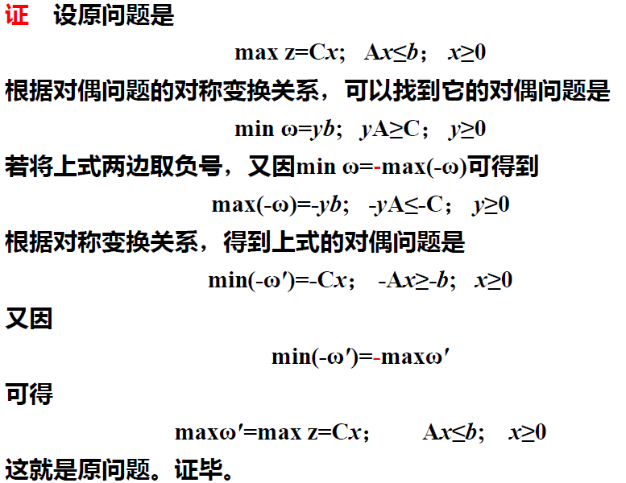

+ **(2) 弱对偶性：若$\overline X$是极大化原问题的可行解,$\overline Y$是对偶问题的可行解。则$C\overline X \leq \overline Y b$**       
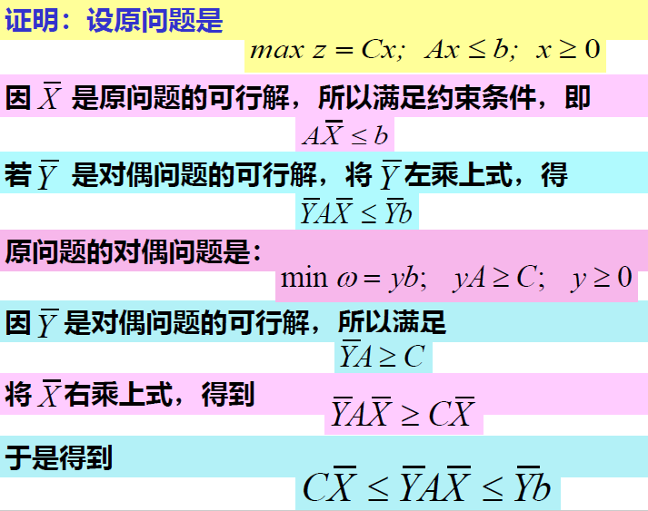

+ **(3) 无界性 ：若原问题为无界解，则其对偶问题无可行解**

+ **(4) 可行解是最优解时的性质:**

  **设$\widehat X$是原问题的可行解,$\widehat Y$是对偶问题的可行解，当$C\widehat X=\widehat Yb时,\widehat X,\widehat Y$是最优解。 **
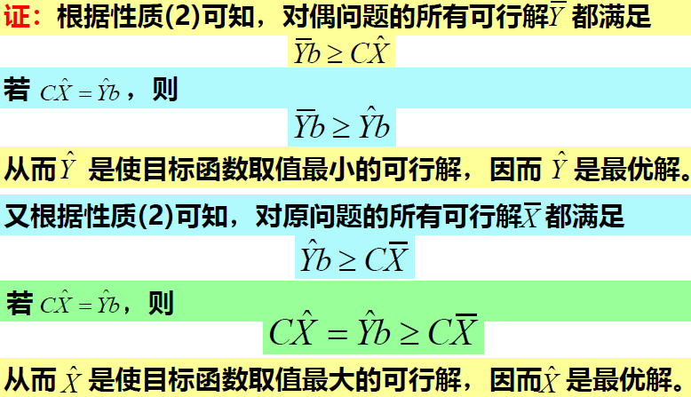

+ **(5) 对偶定理 ：若原问题有最优解，那么对偶问题也有最优解；且目标函数值相等**
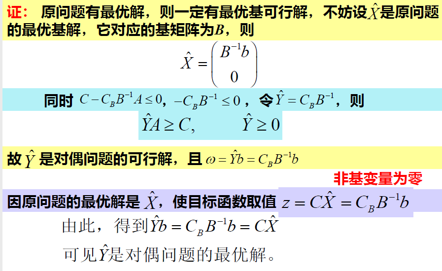

+ **(6) 互补松弛性：**

  **若$\widehat x,\widehat y$分别为原问题和对偶问题的可行解，那么$\widehat yx_s=0和y_s\widehat x=0$；当且仅当$\widehat x,\widehat y$为最优解。**

+ **(7) 原问题检验数与对偶问题解的关系：**

  **对偶问题的最优解是原问题松弛变量对应的检验数的相反数**

#### 4. 运用互补松弛性求对偶问题的最优解

$YX_s=0,YsX=0,Y=(),X=()^T$

#### 5. 灵敏度分析+影子价格的意义

+ 价值系数$c_j$

  + $c_j$是基变量的系数

    若要保证最优解不变，重新计算==所有的检验数==，则$\sigma_j \leq 0$需要成立

  + $c_j$是非基变量的系数

    若要保证最优解不变，计算==j对应的==$\sigma_j \leq 0$需要成立

+ 资源限量$b_j$

  + 问题1：求$b_r$的变化范围：

    利用$B^{-1}b（b列）+B^{-1}（a_{ij}中找）\Delta b \geq 0$

  + 问题2：改变$b_r$,求新最优解

    计算$B^{-1}b（b列）+B^{-1}（a_{ij}中找）\Delta b$，并替换b列，再进行单纯形法或者==对偶单纯形法==

  + 问题3:从市场上购买原料$b_i$，原价为x,是否划算？

    看最终表检验数$b_i$对应的松弛变量的相反数，若x比其小则合算

+ 技术系数$a_j$

  | $c_j$ |       |      | 2     | 3     | 0       | 0          | 0     |            |
  | ----- | ----- | ---- | ----- | ----- | ------- | ---------- | ----- | ---------- |
  | $C_B$ | $X_B$ | b    | $x_1$ | $x_2$ | $x_3$   | $x_4$      | $x_5$ | $\theta_j$ |
  | 2     | $x_1$ | 4    | 1     | 0     | **0**   | **0.25**   | **0** |            |
  | 0     | $x_5$ | 4    | 0     | 0     | **-2**  | **0.5**    | **1** |            |
  | 3     | $x_2$ | 2    | 0     | 1     | **0.5** | **-0.125** | **0** |            |
  | -z    |       | -14  | 0     | 0     | -1.5    | -0.125     | 0     |            |

  + A矩阵增加一列

    设增加$x_k，技术向量P_k= (p_1,p_2,p_3)^T,检验数\sigma_k=c_k-C_BB^{-1}P_k$,若检验数>0,则安排此产品是有利的，其中$C_B B^{-1}$是检验数的绝对值

    计算$B^{-1}P_k(B^{-1}即为表中加粗部分)$即为$x_k的a_{ij}列$

    如增加$P_3=(2,6,3)^T，c= 5$，检验数=5-(1.5,1.125,0)(2,6,3)=1.25>0,有利的

  + A矩阵某一列改变

    $P_k变为P_k'$，计算$B^{-1}P_k'$为新的$a_{ij}$，以及新的检验数

  + ==注意：若经过迭代后发现，b列存在负数，检验数行存在整数，即原问题与对偶问题都没非可行解，加入人工变量处理==

    如$P_1'=(4,5,2)^T$,每件获利5元
    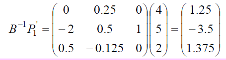，新检验数为$4-(1.5,0.125,0)(4,5,2)^T=-2.625$

    得到新表：

    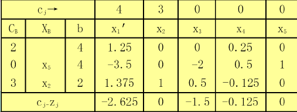

    ，然后将$x_1'$替换$x_1$为新的基变量

    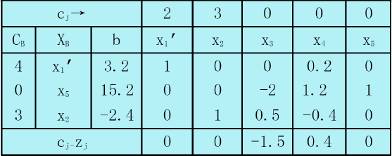

    发现原问题与对偶问题均是非可行解，需要加入人工变量，在$x_2$行加入人工变量$x_6$,

    $0x_1'+x_2+0.5 x_3-0.4x_4+0x_5=-2.4$就变成$-x_2-0.5x_3+0.4x_4+x_6=2.4$

    将$x_6$作为基变量填入表中

    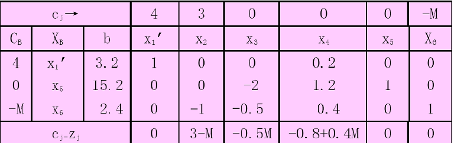

    之后就可以用单纯形法计算了

+ 影子价格：

  约束对应的松弛变量的检验数的相反数即影子价格，若题目给的>影子价格，则不合算

+ 增加一个约束或者改变一个约束

  + 增加约束：直接加入表中，注意保证原来基变量的列为单位矩阵
  + 改变约束：重新计算$B^{-1}P_i与B^{-1}b'$,这里是每一个P与b都有一个元素改变再计算新的检验数

#### 6. 运输问题

求如下产销平衡表中运输问题的最优解与最优值。
| 产地    销地 | 甲   | 乙   | 丙   | 丁   | 产量 |
| ------------ | ---- | ---- | ---- | ---- | ---- |
| 1            | 2    | 9    | 10   | 7    | 9    |
| 2            | 1    | 3    | 4    | 2    | 5    |
| 3            | 8    | 4    | 2    | 5    | 7    |
| 销量         | 3    | 8    | 4    | 6    |      |
+ Vogel法：注意退化
+ 位势法
+ 闭回路调整法：调整的量取环中-1所在的较小值，注意退化
+ 注意产销不平衡

#### 7. 目标规划的建模以及求解

==可分为三类：==

(1) 要求==恰好达到==目标值，即正、负偏差变量都要尽可能地小，这时

$min\quad z=f(d^++d^-)$
(2) 要求==不超过==目标值，即允许超过目标值，但正偏差变量要尽可能地小。这时
$min\quad z=f(d^+)$
(3) 要求==超过目标值==，即允许小于目标值，但必须是负偏差变量要尽可能地小，这时
$min\quad z=f(d^-)$
对每一个具体目标规划问题，可根据决策者的要求和赋予各目标的优先因子来构造目标函数 

#### 8. 割平面法

纯整数线性规划的松弛问题时：去除整数要求

解题步骤：

+ 加入非负松弛变量，变为等式约束，用单纯形表解

+ 从==最终计算表中得到非整数变量对应的关系式==，从基变量的b列以及$a_{ij}$行得到

  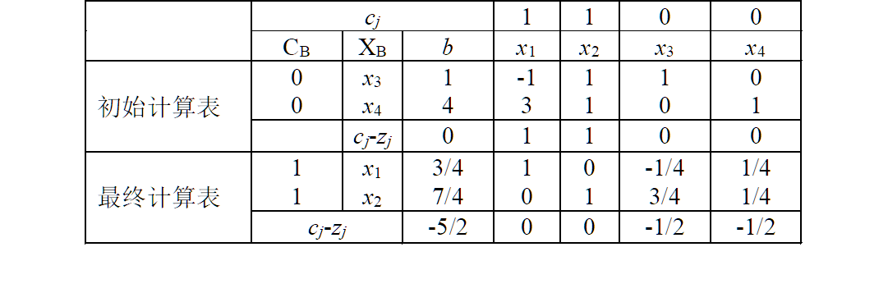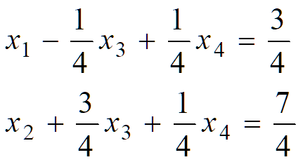

+ 将上式变量的==系数和常数项都分解成整数和非负真分数两部分之和，然后将整数部分与分数部分分开，移到等式左右两边==

  $(1+0)x_1+(-1+3/4)x_3+1/4 x_4=0+3/4\\x_2+(3/4)x_3+(1/4)x_4 = 1+3/4$

  $x_1-x_3 = 3/4-(3/4 x_3+1/4 x_4)\\x_2-1 = 3/4-(3/4 x_3+1/4 x_4)$

+ 利用等式约束构造割平面约束，得到一个割平面方程，加入约束，加入计算表中

  $3/4-3/4x_3+1/4x_4\leq0,即-3x_3-x_4\leq3,即-3x_3-x_4+x_5= -3$

+ 在根据新表进行==对偶单纯形法==

#### 9. 指派问题

解法：

+ **第一步：**使指派问题的系数矩阵经变换，在各行各列中都出现0元素
  (1) 从系数矩阵的==每行元素减去该行的最小元素==
  (2) 再从所得系数矩阵的==每列元素中减去该列的最小元素==
  (3)若某行(列)已有0元素，那就不必再减了。

+ **第二步**：进行试指派，以寻求最优解
  需找出n个独立的0元素。若能找出，就以**这些独立0元素对应解矩阵(xij)中的元素为1，其余为0，这就得到最优解**

  + 当n较小时，可用观察法、试探法去找出n个独立0元素

  + 若n较大时，就必须按一定的步骤去找，常用的步骤为： 
    (1) 从==只有一个0元素的行开始，给这个0元素加圈，记作◎==.这表示对这行所代表的人，只有一种任务可指派。
             ==划去◎所在列的其他0元素，记作Φ==.这表示这列所代表的任务已指派完，不必再考虑别人了。
    (2) 给==只有一个0元素列的0元素加圈，记作◎；然后划去◎所在行的0元素，记作Φ==
    (3) 反复进行(1)，(2)两步，直到所有0元素都被圈出和划掉为止。

    (4) 若仍有没有划圈的0元素，且同行(列)的0元素至少有两个(表示对这个人可以从两项任务中指派其一)。

    ​      这可用不同的方案去试探。从==剩有0元素最少的行==(列)开始，比较这行各0元素所在列中0元素的数目，选择==0元素少的那列==的这个0元素加圈(表示选择性多的要“礼让”选择性少的)。

    ​      然后==划掉同行同列的其他0元素==。可反复进行，直到所有0元素都已圈出和划掉为止。
    (5) 若◎元素的数目==m等于矩阵的阶数n==，那么这指派问题的最优解已得到。若m＜n，则转入下一步。

+ **第三步：**作最少的直线覆盖所有0元素，以确定该系数矩阵中能找到最多的独立0元素。

  为此按以下步骤进行：
  (1) **对没有◎的行打√号**
  (2) **对已打√号的行中所有含Φ元素的列打√号**
  (3) **再对打有√号的列中含◎元素的行打√号**
  (4) 重复(2)，(3)直到得不出新的打√号的行、列为止
  (5) 对==没有打√号的行画一横线，有打√号的列画一纵线==，这就得到覆盖所有0元素的最少直线数，令这直线数为l。
  	若l＜n，说明必须再变换当前的系数矩阵，才能找到n个独立的0元素，为此转第四步
  	若l=n，而m＜n，应回到第二步(4)，另行试探。

+ **第四步：**
  为此在==没有被直线覆盖的部分中找出最小元素==。

  ==打√行各元素中都减去这最小元素，而在打√列的各元素都加上这最小元素==

  保证原来0元素不变。这样得到新系数矩阵

  若得到n个独立的0元素，则已得最优解，否则回到第三步重复进行。

#### 10. 其他题目

##### 10.1 两阶段法

实现最小化

第一阶段：构造新的目标函数，其中人工变量系数为1，其余变量系数为0，用单纯形表求解

若得到$min\quad w = 0$,说明原问题有基可行解，可以进行第二阶段

否则，原问题无可行解

第二阶段：

第一阶段的最终表除去人工变量，目标函数行的系数换为原问题目标函数系数，重新计算检验数并迭代

##### 10.2 分支定界法

##### 10.3 利用单纯形表算数据

表1中给出某一求极大化问题的单纯形表，表中无人工变量，$a_1,a_2,c_1,c_2,d$为待定常数，试说明$a_1,a_2,c_1,c_2,d$分别取何值时，以下结论成立：
(1) 表中解为唯一最优解；
(2) 表中解为无穷多最优解之一；
(3) 下一步迭代将以x_1替换基变量x_5;
(4) 该线性规划问题具有无界解；

|           | $x_1$                                            | $x_2$  | $x_3$  | $x_4$ | $x_5$ |       |
| --------- | ------------------------------------------------ | ------ | ------ | ----- | ----- | ----- |
| $x_3$     |  | **4**  | $a_1$  | **1** | **0** | **0** |
| $x_4$     | **2**                                            | **-1** | **-5** | **0** | **1** | **0** |
| $x_5$     | **3**                                            | $a_2$  | **-3** | **0** | **0** | **1** |
| $c_j-z_j$ | $c_1$                                            | $c_2$  | **0**  | **0** | **0** |       |

答：
	表中解为唯一最优解:==$d≥0,c_1<0,c_2<0；$==
	表中解为无穷多最优解之一: $d≥0,c_1≤0,c_2≤0,c_1* c_2=0 ；$
	下一步迭代将以$x_1$替换基变量$x_5$: $d≥0,c_1>0,a_2>0,3/a_2 <d/4$
	该线性规划问题具有无界解:$d≥0,c_2>0,a_1  ≤0；$

## 动态规划原理部分题目

### 1. 顺推和逆推问题

#### 1.1 运输费用最小问题

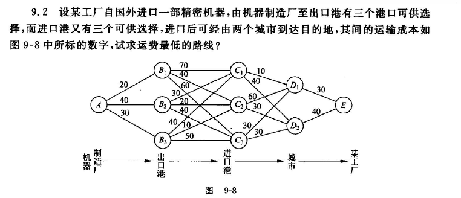

#### 1.2 最短路线问题

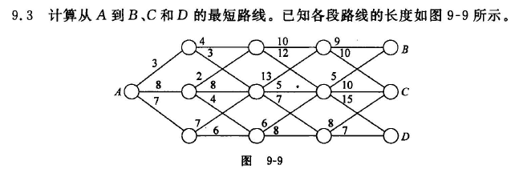

### 2. 解方程

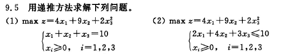

## 动态规划应用部分题目

### 1. 资源分配问题

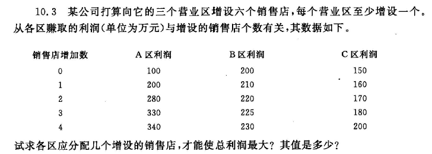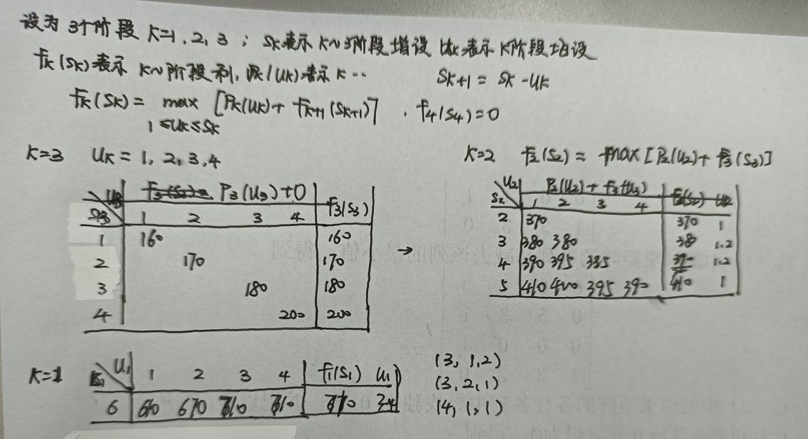

### 2. 连续资源分配问题--注意利用讨论中的性质

==一般结果：先连续低负荷t-1年，t年转入高负荷生产，应满足的极值关系的条件：==

n个年度，高、低负荷生产的产量函数：$g=cu_1,h=du_2,c>d>0$

年回收率a与b,$1>b>a>0$

==$\begin{cases}c-d>c(1+a+a^2+...+a^{n-(t+1)})(b-a)\\c-d<c(1+a+a^2+...+a^{n-t})(b-a)\end{cases}$==

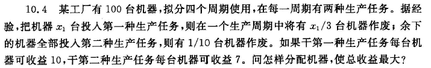

### 3. 生产计划问题

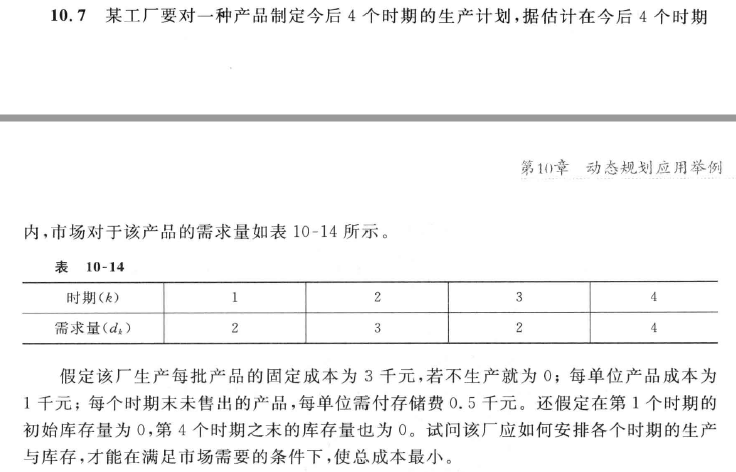

+ 解题初始设定：

  设==$d_k$为第k阶段对产品的需求量，$x_k$为第k阶段该产品的生产量，$v_k$为第k阶段结束时的产品库存量，则有$v_k=v_{k-1}+x_k-d_k$==

  ==$c_k(x_k)$表示第k阶段生产产品$x_k$时的成本费用==，==它包括生产准备成本$K$和产品成本$ax_k$====(其中a是单位产品成本)两项费用==，即$c_k=\begin{cases}0 & x_k=0\\K+ax_k & x_k=1,2,..m\\ \infty & x_k>m  \end{cases}$,m表示每阶段最多能生产该产品的上限数

  ==$h_k(v_k)$表示在第k阶段结束时有库存量$v_k$所需的存储费用==，k阶段的成本费用：$c_k(x_k)+h_k(v_k)$

  动态规划的顺序递推关系:   $f_k(v_k)=min_{0\leq x_k\leq \sigma_k}[c_k(x_k)+h_k(x_k)+f_{k-1}(v_k+d_k-x_k)],k=2,3,4\\其中\sigma_k=min(v_k+d_k,6)\\边界条件f_1(v_1)=min_{x_1=min(v_1+d_1,m)}[c_1(x_1)+h_1(x_1)]$

==计算步骤：==

当k=1时，$f_1(v_1)=min_{x_1=min(v_1+2,6)}[c_1(x_1)+h_1(v_1)]$,对$v_1\in(0,min[\sum_{j=2}^4d_j,m-d_1])=(0,4)$进行计算

$v_1=0:f_1(0)=min_{x_1=2}[3+0.5*0]=5,x_1=2\\v_1=1:...\\v_1=2:...\\v_1=3:...\\v_1=4:...$

当k=2,$f_2(v_2)=min_{0 \leq x_2 \leq \sigma_2}[c_2(x_2)+h_2(x_2)+f_1(v_2+d_2-x_2)]$ $\sigma_2=min(v_2+d_2,6),对v_2在0~min[\sum_{j=3}^4d_j,m-d_2]$进行计算

当k=3...

当k=4...$v_4=0,h(v_4)=0$

再顺序反推算

### 4. ==再生产点性质==解上述生产计划问题

+ 设$c(j,i) (j≤i)$为阶段j到阶段i的总成本，给定$j−1和i$是再生产点，并且阶段j到阶段i期间的产品全部由阶段j供给，则==$c(j,i) = c_j(\sum_{s=j}^id_s)+\sum_{s=j+1}^i c_s(0)+\sum_{s=j}^{i-1}h_s(\sum_{t=s+1}^id_t)$==

  注：_j到 i的总成本=j阶段生产的成本（这一部分的全部由j生产）+剩余阶段的生产成本（不生产：0）+储存成本（j到i-1阶段结束需要储存，储存量是s+1阶段到i阶段的数量和）_

+ 设最优值函数$f_i$表示在阶段i末库存量$v_i=0$时，从阶段1到阶段i的最小成本，则对应的递推关系式为==$f_i=min_{1\leq j \leq i}[f_{j-1}+c(j,i)](式2-7)$,边界条件是$f_0=0$==

+ 为了确定最优生产决策，逐个计算$f_1,f_2,..f_n$,则$f_n(0)$为n个阶段的最小总成本

+ 设$j_n$计算$f_n$时，使(2-7)式右边最小的j值，即$f_i=min_{1\leq j \leq i}[f_{j-1}+c(j(n),i)]$

+ 所以，从阶段$j(n)$到阶段n的最优生产决策为：$x_j(n)=\sum_{s=j(n)}^nd_s$$x_s=0 当s=j(n)+1,j(n)+2,...n时$。故$j(n)-1$为再生产点

+ 为了进一步确定==阶段$j(n)−1$到阶段1==的最优生产决策，记$m=j(n)−1$，而$j(m)$是在计算$f_m$时，使(2-7)式右边最小的j值，则从==阶段j(m)到阶段j(n)==的最优生产决策为：$x_j(n)=\sum_{s=j(m)}^m d_s$$x_s=0 当s=j(m)+1,j(m)+2,...m时$。故$j(m)-1$为再生产点

## 图与网络规划部分题目

### 1. 图的支撑树

 用破圈法和避圈法求图的支撑树

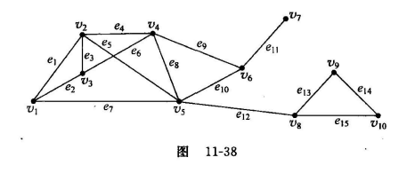

### 2. 图的最小支撑树

 用破圈法和避圈法求图的最小支撑树

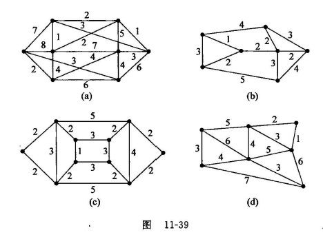

### 3. 最短路问题

#### 3.1 到终点的最短路

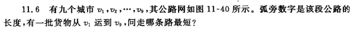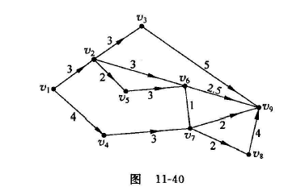

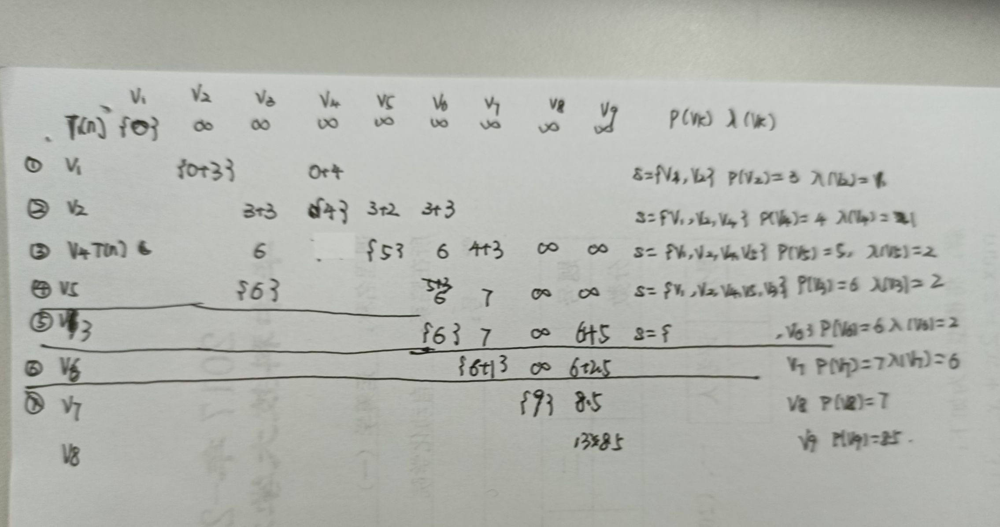

#### 3.2 权有负数时最短路

求图中$v_s$到个点的最短路

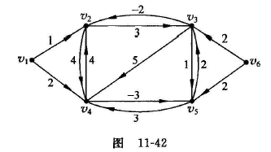

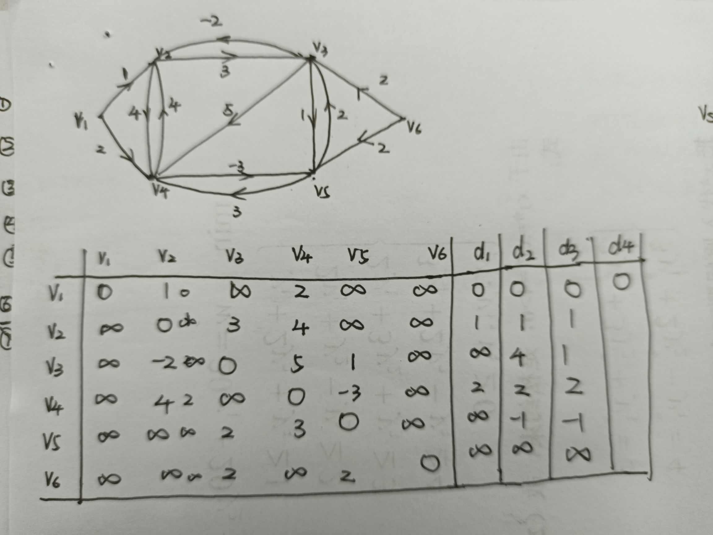

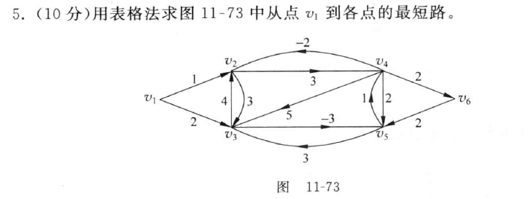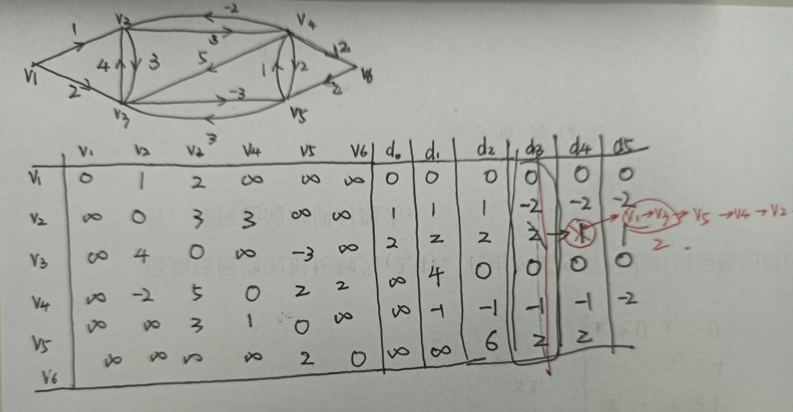

### 4. 最大流问题 

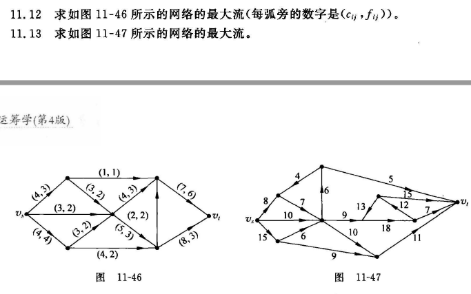

### 5. 最小费用最大流问题

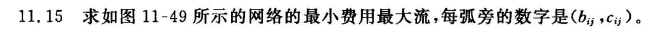

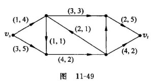

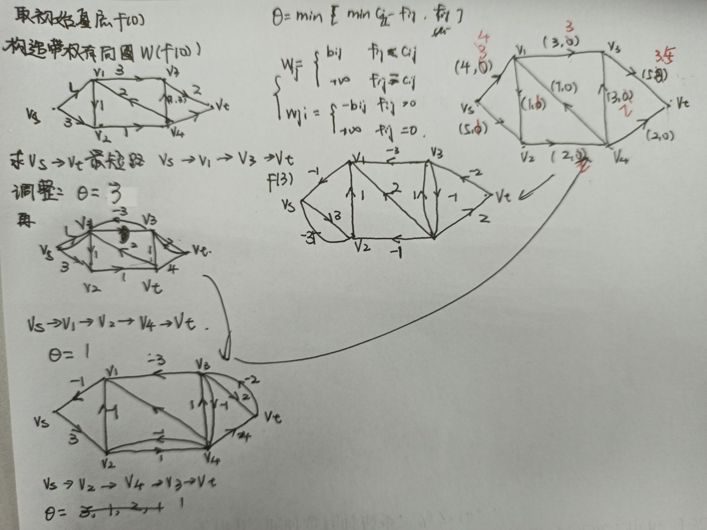

